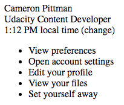

I recently decided to brush up my Front-End skills, in parts because I want to rebuilt this blog from the ground up, but also simply because it is a thing I have meant to do for a very long time. And now is the perfect time 😊 (Hint: "Now" is always the perfect time 😊)
<!--end-->

## Where am I coming from?

First of all, let me start by saying I am not a total beginner. That is not to brag, but rather to not create unrealistic expectations for _actual_ beginners. What I achieved in 6 hours, after having learned CSS for only 24h before, was not achieved in 6 hours, with only 24h of CSS experience. I have been exposed to Web Development and UI layouts for quite some time now, and while I had never _studied_ CSS, I am familiar with many related concepts.

The thing is: I can build simple websites with soemthing like bootstrap, I know how to customize a theme, no problems there and thanks to my experience with Mobile Development, React was really easy for me to pick up. But so far all my work on HTML/CSS, while functional (this blog), has remained a bit of a hack. Poking things around until it works, without really fully understanding the "consequences of my actions" 😊. And if you know anything about me, you know that while I value trial-and-error in pretty much any situation, it still comes with the prerequisites of being comfortable with the basics. So, that's what my current focus is all about when it comes to Front-End: Being comfortable with the basics, having strong foundations, and building upon them.

## The Project
I am currently following a course on Udacity, I went for the Front-End Nanodegree. I mean sure I could have gone for a free course, but I'm familiar with Udacity and I know that I, personally, am happy to pay for their services. They are the ones who made it possible for me to become an Android developer in the first place back in 2015. Is it a recommendation? Nope, you make your own choices, I don't have enough experience with the competition to really compare, but yes I do love Udacity.

That put aside, after learning the bits of CSS, there was this one mini-quizz where an incomplete HTML/CSS file was given and the goal was to add the missing classes to make it look like this:

But I figured it didn't seem too complex in terms of layout, most things were just one below the other. Yet, it still felt impressive... out of reach. And that means it would be a perfect mini-project to build from the ground up. Challenging enough to be compelling, but not too much to be demotivation. Goldilocks principle 101.

So, instead of performing the exercise of adding classes to a pre-existing HTML/CSS file, I started from a blank slate.

###### It went from this

###### To this

###### To finally this

## The Front-End Kata

Impressive? Well, maybe yes, maybe not depending on who you are. But for you, that was a big Yes!

Not because the result itself is impressive, it's a basic Slack card. But because 6 hours prior I would have never imagined I could produce something like that from... nothing. _People?_ Yes. _Me?_ ... Apparently Yes as well. And that means yes for **You too**.

So my main takeway from this experience is: **Pure CSS is not as scary as I imagined**

> Again, if you're struggling and maybe even have tried, and couldn't replicate a simple design like that in 6h, remember that [I am not a complete beginner either](#where-am-i-coming-from) and that ["Everthing is difficult before it becomes easy"](/about#professional-beginner).

It is only the beginning, after all it is a simple design I am by no mean clamining to be a CSS ninja after only one tiny project like this. But the most important part is that it gave me the confidence and motivation to investigate further without apprehension.

I had started this project with CSS-anxiety, and now I can't wait to try many new things with CSS 😍

Not only did I discover that CSS wasn't as terrible as I imagined, I also discovered a wonderful way to practice and learn more about it while having fun, I name: **The Front-End Kata** aka replicating simple designs in CSS strarting with a blank slate.   

> ... to be fair, I'd be extremely surprised if I was the first one to have this idea, but _I_ had never though about it before. 

It makes so much sense though, just like a Code Kata (ie [ES6 Katas](https://es6katas.org/), [Katalyst](https://katalyst.codurance.com/), ...) where the goal is to implement a simple behavior repeateadly to gain confidence and discover each time new ways to go about things, a Front-End Kata has the similar scope and similar results. Katas are based in repetition, but often even after just one pass you start seeing the benefits of it (this is my way of saying I won't be doing 30 different versions of this one particular Slack Card 😊)

So yes, in parallel to keep learning the fundamentals, I think I'll continue to practice my Front-End skills this way: Finding a simple design, probably on something like [Dribble](https://dribbble.com/shots/popular/web-design), and replicating it in pure CSS, from a blank slate, with no frameworks.

*Until next time --- The Professional Beginner*
