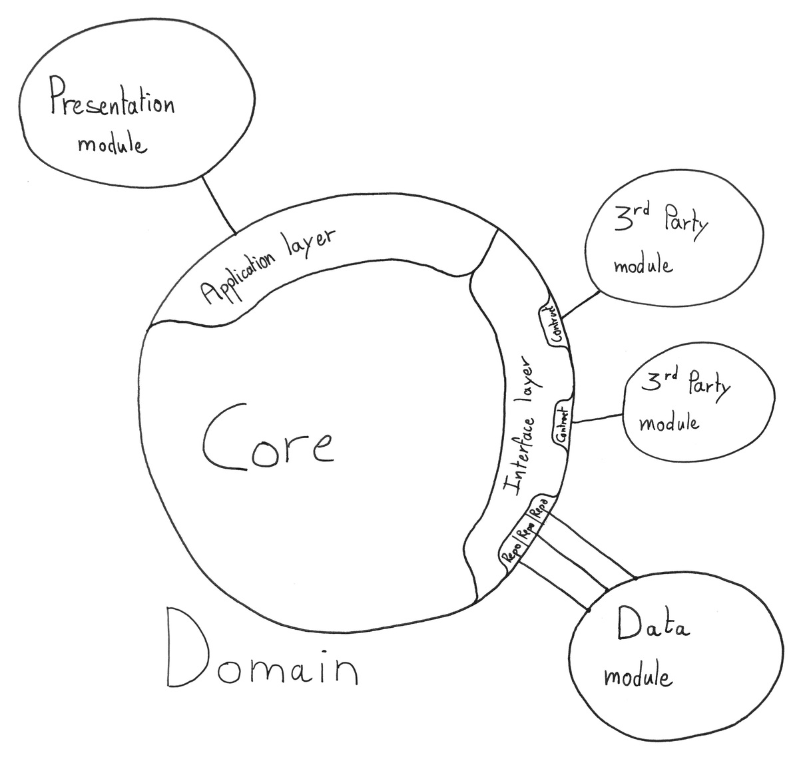
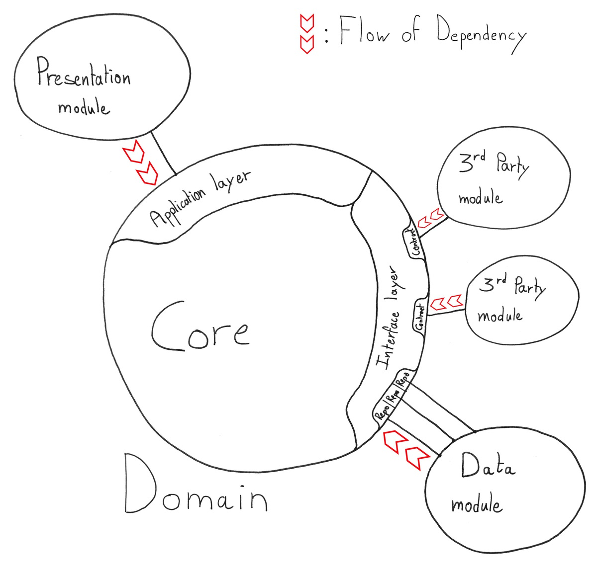
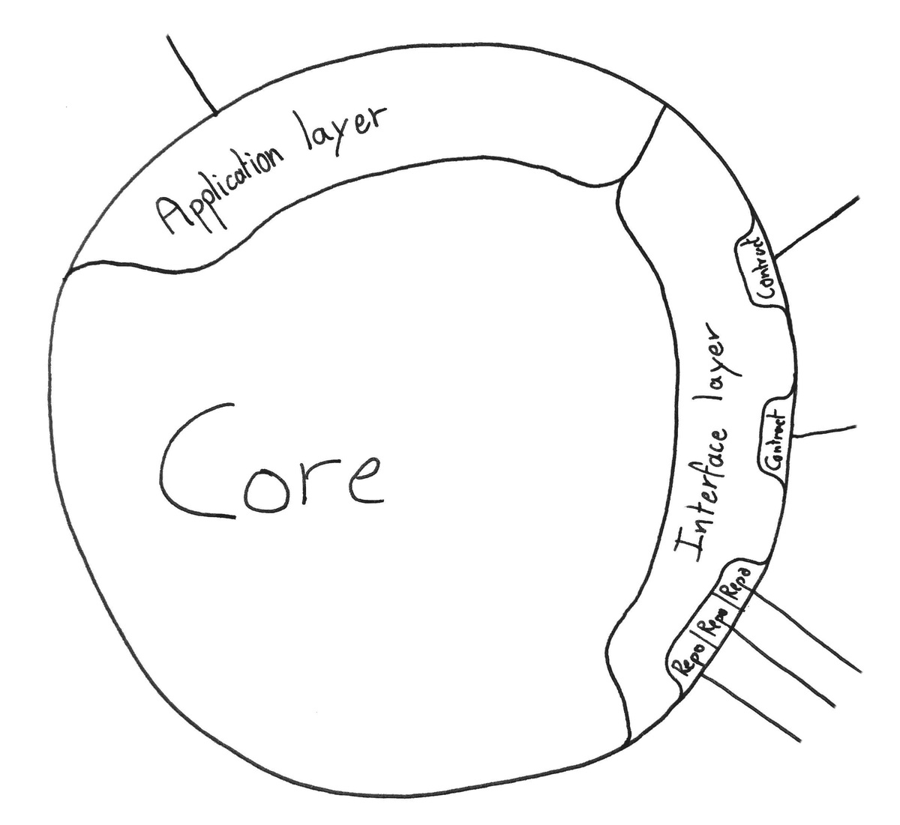
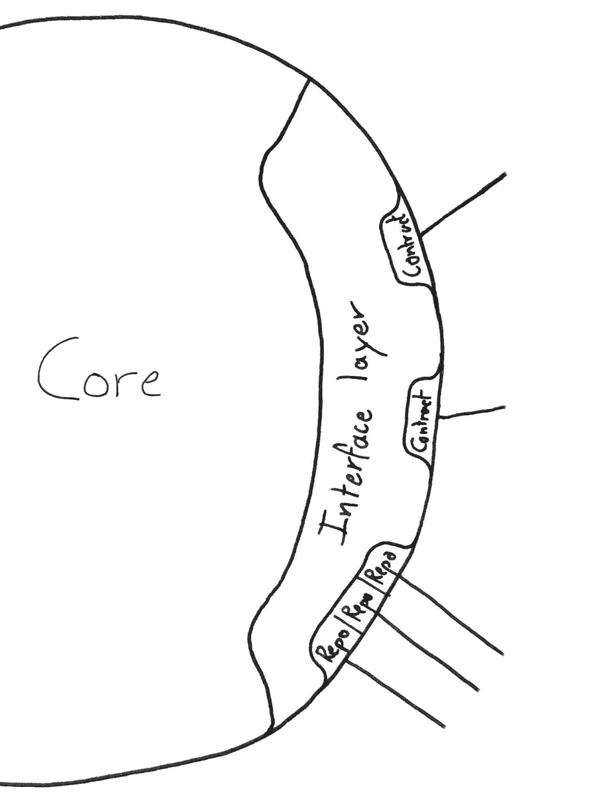
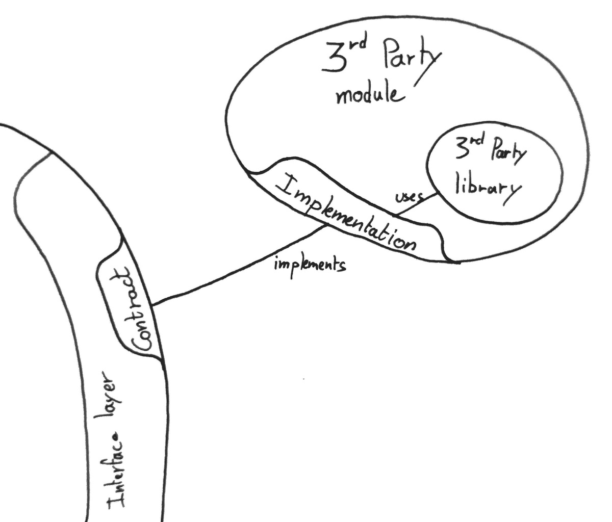
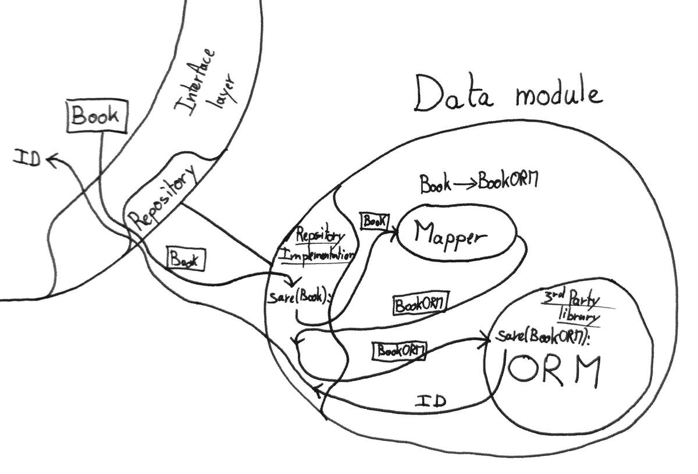
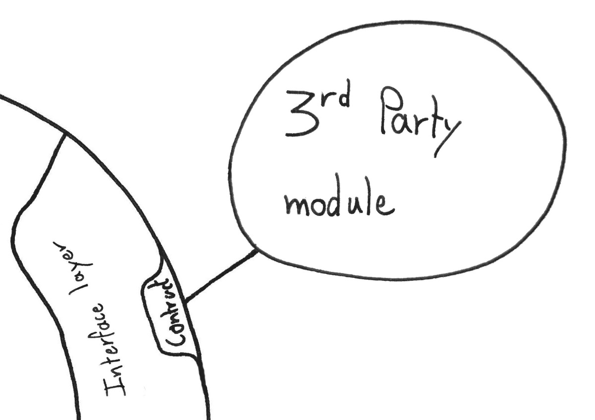

When developing a new project in software development there seem to always be this Cornelian dilemma: Build fast and throw later or Build slow and re-use.

I believe there is a third way, a middle ground where **current productivity encounters future maintainability**.
And others believe it too. 
The problem is<!--end--> that despite countless hours, days, even months of searching.
I could never find an example that would truly resonate with me. 
I would never understand the big picture. 
And while examples I could find, seemed to work quite well in theory:
I could never really adapt their methodologies to my own projects, there was always that one thing that would not add up.

So I went on a quest to create my own Archetype.
A structure that would be quick to deploy and yet lie the base for future maintainability.

In this article I will present to you what took me a year to craft: **My Java Archetype**

It is nothing revolutionary and in a sense nothing new. 
Yet it is a set of best practices and a structure that allow me to be productive and focus on the business logic while building what I believe to be maintainable software.

> To really understand each and every concept I mention in this article, I highly encourage you to check out the example project:
>
> [My Java Archetype - An Example](https://github.com/ShockN745/My-Java-Archetype)

## The Archetype

### Big picture first

Before diving into the description of the modules and layers of my Archetype, let's first start with an overview of the architecture.

As mentioned earlier, nothing new, the architecture is very close to what we could find in the Hexagonal Architecture, the Onion Architecture or the Clean Architecture.
It is built around **separation of concerns**.

With that in mind, there are mostly 5 parts with different roles:

 * **Presentation module:** Where the web-framework, or UI SDK, is confined.
 * **Domain: Application layer:** Orchestrate operations on the application.
 * **Domain: Core:** Contains the business logic of the application
 * **Domain: Interface layer** Expresses Domain needs to be fulfilled
 * **Data module:** Where the persistence logic is confined.
 * **Extra: 3rd-Party:** Could be parsing libraries, network libraries, etc ...

###### Flow of dependencies pointing inwards

In this Archetype, just as in the other architectures mentioned above, the **Flow of dependencies is pointing inwards**.

 * **The Presentation module** depends on the **Domain**, it uses services of the Domain through the Application layer. 
 * **The Domain** does not depend on anything, and has no knowledge of any other modules besides itself.
 * **Extra modules** do not depend on Domain services, but on the expression of the **Domain's need**.
   See section on [The Interface layer](#the-domain-interface-layer "The Interface Layer") for more details on this.

#### A long but hopefully complete article 

For each one of these modules/layers I will present the **role** they play in **my Archetype**, the way I implement them, as well as the tradeoff I am willing to make in order to maintain this balance, between productivity and future maintainability.

###### [Introduction](#article-title)

###### [Presentation module](#the-presentation-module)
  * [Role & Highlights](#rh-pres)
  * [Interface with the User](#interface-user)
  * [MVC, MVP, MVVM](#patterns)

###### [Domain: Application layer](#the-domain-application-layer)
  * [Role & Highlights](#rh-app)
  * [Elements](#elements-app)
  * [Interaction with the Presentation module](#interaction-pres)
  * [Making the Domain (Quasi-)Stateless](#stateless)
  * [Accessing the Data module](#access-data)

###### [Domain: Core](#the-domain-the-core)
  * [Role & Highlights](#rh-core)
  * [Elements](#elements-core)
  * [Designing the Domain 101](#designing-domain)
  * [My Best Practices](#best-practices)

###### [Domain: Interface layer](#the-domain-interface-layer)
  * [Role & Highlights](#rh-interface)
  * [Enhancing the Core](#enhancing-core)
  * [Example: A weird XML parser](#parser-example)
  * [Persistance: Another contract](#persistence-contract)

###### [Data module](#the-data-module)
  * [Role & Highlights](#rh-data)
  * [Just another Domain's need](#domain-need)
  * [ORMs and Mapping](#orm)
  
###### [Extra: 3rd-Party modules](#3rd-party)
  * [Role & Highlights](#rh-third)
  * [Implementing contracts](#implementing-contracts)
  
###### [Conclusion](#concl)

------------

### The Presentation module

#### Role & Highlights
 * User-Interface
 * Delegates operations to the application 
 * Formats the result
 * Where the Web-Framework, or Mobile SDK, or GUI SDK is confined.
 * Implements MVC, MVP, MVVM or other
 

#### Interface with the User

The only role of the Presentation module is to delegate operations to the application and format the result.
The Presentation module is where the Web-Framework, or the Android SDK for a mobile application, is confined.
There should be no trace of Web-Framework, or Mobile SDK, outside of the Presentation module.

The Presentation module does not contain any Domain logic, it simply delegates operations to the Application via the Application layer.

The Presentation module does not hold any state from Domain but does hold an ID to retrieve it.

###### Example of interaction in the Presentation module

~~~ java
@RequestMapping("/itinerarySelection")
public String showItinerarySelection(Request request, Model model) {
    // Retrieve ID (Here stored with the client)
    String trackingId = request.getParameter("trackingId");

    //////////////////////////////////
    //  Query the Application layer //
    //////////////////////////////////
    List<RouteCandidate> routeCandidates = 
        bookingService.requestPossibleRoutesForCargo(trackingId);
    CargoRouting cargo = 
        bookingService.findCargoRoutingInformations(trackingId);

    ////////////////////////
    //  Format the result //
    ////////////////////////
    routeCandidatesDTOs = assembler.toDTO(routeCandidates)
    cargoDTO = assembler.toDTO(cargo)
    model.put("routeCandidates", routeCandidatesDTOs);
    model.put("cargo", cargoDTO);
    return "templates/admin/selectItinerary";
}
~~~

#### MVC, MVP, MVVM

This Archetype does not replace architectural patterns related to how to handle the presentation logic.
Such common patterns are Model-View-Controller, Model-View-Presenter or Model-View-ViewModel.

They do still have their place.
But are **confined** within the Presentation module.

------------

### The Domain: Application layer

#### Role & Highlights

 * Offer a single point of access to the Domain 
 * Orchestrate operation on the Domain
 * Offer Services that act on the Domain
 * Handle the Domain state lifecycle
 

#### Elements

The Application layer is composed of **Application Services**.

Each Application Service groups a set of methods centered around a common topic.
Each of these methods orchestrates Domain Objects to model a specific use-case.

###### Example signature of an Application Service
~~~ java
public interface BookingService {

  TrackingId bookNewCargo(Location origin, Location destination);

  CargoRouting findCargoRoutingInformations(TrackingId Id);
  List<RouteCandidateDTO> requestPossibleRoutesForCargo(TrackingId id);

  void assignCargoToRoute(TrackingId id, RouteCandidate route);
  void changeDestination(TrackingId id, String destinationUnLocode);

  List<Location> listShippingLocations();
  List<Cargo> listAllCargos();

}
~~~

#### Interaction with the Presentation module

All interactions with the application must go through the Application layer. 
It is the **only point of interaction** with the Domain.

In my Java Archetype I do not use DTOs between modules to represent Domain Objects, as opposed to what I discussed in this article: [The DTO Dilemma](/post/8 "The DTO Dilemma").
The Presentation module technically has access to Domain Objects, as return values of the Application layer, and could potentially call methods on them. In my Archetype, this is **forbiden**. 

> Although not enforced, it is **forbidden** for the Presentation module to call methods directly on Domain Objects.

The Presentation module does, however, have access to Domain [Value-Objects](#elements-core), since these are merely immutable data structures. 
Domain Value-Objects can be used to construct complex arguments to pass to the Application layer.

###### Using Value-Objects to construct arguments
~~~ java 
public String saveNewBook() {
    /////////////////////////////////
    // Construct complex arguments //
    /////////////////////////////////
    Characteristics characteristics = new Characteristics(
            "Moby Dick",        // Title
            "Herman Melville",  // Author
            704                 // Num of pages
    );
    Price price = new Price(9.99);

    ////////////////////////////////////////
    // Pass them to the Application layer //
    ////////////////////////////////////////
    BookId id = bookService.createNewBookEntry(characteristics, price);

    return id.idString();
}
~~~

Finally, the **Flow of Dependency** pointing inwards towards the Domain: The Application layer has no knowledge of the Presentation module. 
It simply offers services to be used.

#### Making the Domain (Quasi-)Stateless

The Application layer is where instances of Domain Objects are manipulated.

That means the Application layer has access to the state of the Domain. 
Actually, the state of the Domain is confined within the Application layer and is **transient**.

> The state of the Domain is Transient

Instances of Domain Entities do not exist outside the scope of an Application Service method call.

> How is that possible? 

Instances of Domain Entities are not retained.
Only is kept an **ID** to access them.
The state of Domain Entities is **persisted** between every operation and is retrieved via the **ID**.

This means any operation on the Domain offered by the Application layer takes an **ID** as a parameter. 
This allows the Application layer to retrieve the persisted state of a Domain Object, create an instance, and act on it

To allow the Presentation module to retrieve this **ID** in the first place, every Application Service must offer an **initialisation** use-case.

In the `BookingService` [example](#elements) above, the initialisation use-case is `bookNewCargo`, it returns a `TrackingId`.
Then every other operation takes the `TrackingId` as a parameter.

One last point to note is that instances of Domain **Services** are retained, but they are stateless therefore do not contribute to the state of the Domain.

#### Accessing the Data module

Even though the Application layer handles the lifecycle of Domain Objects, it has no knowledge of the implementation of the persistence logic.
Instead, it accesses the Data module through an interface: [The Repository](#persistance-another-contract "Persistence: Another contract")

###### There is only one fundamental rule

To keep the Transactions confined in the Data module, each method of an Application Service can only persist **one** type of Aggregate Root.
To persist multiple Aggregate Roots, multiple methods are needed.

> Each method of an Application Service can only persist one Aggregate Root

If an operation really needs to persist 2 different Aggregate Roots at the same time, the Aggregate boundaries may need to be re-thought.
It is however totally fine to read Aggregate Roots across multiple Aggregates, only the write side is constrained.

Transitions, Aggregates, Aggregate Roots? No stress, I introduce these concepts a bit later: [Designing the Domain 101](#designing-domain)

------------

### The Domain: The Core

#### Role & Highlights

 * Main part of the application
 * Contains all the business logic
 * Free of any dependencies 
 * Entirely built using TDD
 

#### Elements

##### The Building Blocks
 
###### Value-Object
  * Simply an immutable data structure
  * Holds and group values
  * **Equality**: By Values

###### Entity
 * Object with state & operations
 * Holds state as Value-Objects
 * Has an identity
 * **Equality**: By id

###### Service
 * Stateless
 * Has operations that act on Entities
 * Similar to Application Services, but not accessible to the Presentation module
 * **Equality**: Stateless so no equality needed

##### Free of dependencies

In the next section, I go a bit more in-depth about how these elements are organized in the domain. But, what is important to realize right away is that the Domain is **free of any dependencies**.

There is no trace of Web-Framework or any third party libraries.
Which means that the business logic can ---and must--- be implemented using only Plain Old Java Objects: POJO. 

Since the Domain is composed only of POJOs: 
implementing the business logic is a breeze, testing is easy, and never the tools you use are in the way when maintaining the application.

This does not mean, however, that the Domain can not use services provided by third-parties.
But they must be wrapped in an interface, and the Domain must have no knowledge of the implementation.
More on that in [The Interface layer](#the-domain-interface-layer "The Interface layer")

There are two exceptions I am willing to make: 

 * Using Guava as an extended standard library
 * Keeping in the Domain annotations from the IOC Container

#### Designing the Domain 101 

The Core of the Domain does not need to handle its own persistence. 
Core Entities and Services simply implement operation of the business logic. 
The lifecycle of Domain Objects is managed in [The Application layer](#the-domain-application-layer "The Application layer").

##### No Transactions

The Application layer, being part of the Domain, is also free of any external dependencies.
Which means it can not use database Transactions.

Well to be more accurate, we could think of a way to model the abstraction of a database Transaction, and still use persistence as a stateless Service while keeping the Domain oblivious to the persistence logic.
I believe the [Unit of Work](https://martinfowler.com/eaaCatalog/unitOfWork.html) Pattern does just that. 
However, it slightly goes against the idea of keeping my Archetype lean, and easy to reason about.

> There are **no Transactions** in the Domain

No Transactions in the domain does not mean eradicating Transactions altogether.
Transactions are really helpful when inserting or updating a set of related objects into the database.
They ensure the integrity of the database in case something goes wrong in the middle of the update process. 
Either all related operations succeed, or none are executed.

It is possible to benefit from the advantages of Transactions without having any traces of them in the Domain.
The solution is simple: Persist all related objects in one call.
The Data module will then take care of spreading the objects across multiple Tables and wrap operations in Transactions if that's needed.

> Persist all related objects in **one** call.

To be able to do that, the concept of **Aggregate** is introduced.

##### Aggregates & Aggregate Roots

An Aggregate is simply the definition of a set of **closely related** Domain Objects.
These Objects are packed together and their formation is given a name.

Basically, an Aggregate is just like a folder grouping files, except here files are Objects and the folder is the Aggregate.
In Java, an Aggregate can be represented by a specific package.

For instance, the Book Aggregate could contain a Review Entity, a Price Value-Object, a set of book Characteristics as Value-Objects, and of course a Book Entity.

###### Two simple rules apply when designing Aggregates

 - Domain Objects can not belong to multiple Aggregates
 - A Domain Entity can not hold a reference to another Entity located in another Aggregate.
 
On the last point, holding a reference to the **Id** of an Entity from another Aggregate is totally fine.
Only holding a reference to the actual Entity is forbidden.

Similarly, there is no problem accessing Value-Objects from differents Aggregates, since they are merely immutable data-structures.

###### The important part

Now comes the crucial part, and that is: 

 - Only Entities are persisted
 - Only **one** Entity per Aggregate is persisted. 
 - This Entity is called the **Aggregate Root**.

Moreover, as mentioned in the part about [The Application layer](#stateless), Service operations only act on **persisted** Entities. 
This means the Aggregate Root is the single point of entry to manipulate all other Domain Objects belonging to its Aggregate.

> Only the Aggregate Roots are persisted, and they are the single point of entry in the Aggregate

Since all closely-related Domain Objects are accessed and **persisted** through a **single** Entity, the Aggregate Root, it is now possible and easy to delegate the choice of using Transactions, or not, to the Data module.

###### Understanding is just one example away

To really understand each and every concept I mention in this article, I highly encourage you to check out the example project: [My Java Archetype - An Example](https://github.com/ShockN745/My-Java-Archetype)

In the example project, there are 2 different Aggregates: The Book Aggregate and the User Aggregate.
In the Book Aggregate, the `Book` Entity is the Aggregate Root.
In the User Aggregate, the `User` Entity is the Aggregate Root.

In the Book Aggregate, only `Book` and `Review` are Entities, the rest are Value-Objects.

The `Review` Entity is interesting here. 
It is an Entity of the Book Aggregate, but not the Aggregate Root.
Therefore is it persisted only when the Aggregate Root is persisted.
In this case, when the `Book` containing the `Review` is persisted.

Moreover, it contains a reference to a `UserId` that identifies the owner of that `Review`. 
`UserId` belongs to a different Aggregate but it is a Value-Object.
Value-Objects can be shared accross Aggregates.
`Review` could not, however, contain a reference directly to a `User` since `User` is an **Entity** from another Aggregate.

##### A simple yet powerful concept

This concludes the part on Aggregates and Aggregate Roots. 
Grouping together closely relating Objects not only allows to delegate the use of database Transactions to the Data module but also makes the application easier to reason about.

Aggregates and Aggregate Roots are a particular concept because: At first, they seem overwhelming.
After seeing an example, they seem underwhelmingly simple.
And finally, when implementing them their complexity oscillate between these 2 extremes, depending on how well our model is defined.

> ###### My rule of thumb
> If an Entity makes sense existing by itself.
> It would go into its own Aggregate, and be the Aggregate Root.
> If not, it would go into the Aggregate of the Entity it depends on.

This also concludes the part on designing the Domain. 
What follows are a set of best practices I apply when implementing the Domain.
They are opinionated, but allow me to be productive while building maintainable software.
Feel free to cherry-pick whichever you like.
 

#### My Best Practices

###### TDD
The more I use TDD the more I love it. It's a choice, get over it ^_^.
If you are interested to know more about my interest in TDD, check out this article: [TDD, my hopes](/post/3 "TDD")

###### Always-valid Domain Objects
Domain Objects with state, Entities, and Value-Objects are always in a valid state.
Validation is done at construction, and when setting fields.
Non-checked exceptions are thrown in case of invalid state.
Validation errors are covered by tests.

Extra validation can ---and should--- be added to the Presentation module to avoid invalid Domain state, and replace missing values with defaults.
This leaves the control of defaults to the Presentation module.

###### No primitive type in entities
Simple as that.
Every single primitive type is wrapped in a Value-Object.
This introduces very little overhead, yet greatly increases flexibility.
On top of that, validation can be ---and often is--- added to these Value-Objects.

###### NULL Object Pattern
Never return a null value.
Use a NULL-Object instead.
It is an instance with default fields.
If explicit check is needed, compare on ID which is also a specific NULL-Id.

###### Small functions
To implement a functionality, use a multitude of very small functions.
They compose together to realize the behavior.
Small and focused functions act as documentation and replace the need for comments to some extent.
They make the code read like prose as much as possible.
These functions are implementation details, they are private and not tested. 
Only the outer functionality is tested, in order to not couple tests to the implementation.

###### Composition over inheritance
Inject and delegate, instead of inherit and ... be confused.

###### No static methods
Simple as that. Inject instance of stateless utility class if needed. 
Yes I know, static methods can be mocked ... still.

------------

### The Domain: Interface layer

#### Role & Highlights

  * Defines needs in the Domain
  * De-couples the Domain from external dependencies
  

#### Enhancing the Core

The Domain must be free of any external dependencies. 
And yet it can use services from the Data module or 3rd-Party tools, like a network library.

> How's that possible? 

This is where the Interface layer comes in. 
The Interface layer is part of the Domain and is **where the Domain defines its needs to be fulfilled**.

 1. **The Interface layer** is composed of interfaces, as **contracts**, that define the need for a service. 
 2. **External modules** offer an **implementation** of such contract.
 3. Domain Objects that need to use any external service, are **injected** with the interface/contract. 

With this technique, Domain Objects are able to use external services, without any knowledge of the implementation.
In other words, the Domain does not depend on anything defined outside of the Domain.
And there's more.

##### "Interface we wish we had" --- Clean Code

Since any external tool used by the Domain is wrapped in an interface.
We are no longer bound to the choice of the external tool maker.

When using an external tool directly in our software, we make ourselves dependent on this tool.
If the API is quirky, or even seriously messed up, we will have quirky, messed up, code in our codebase.
If a method call becomes deprecated, we will have deprecated code in our codebase.

By wrapping any external third-party in an interface/contract we shield ourselves from these problems, keep the Domain free of dependencies, and are even able to quickly swap implementation if that's needed.

Lastly, these interfaces can be covered by learning tests, offering a free regression suite at the same time. 
No more fear when updating the project dependencies.

All of this, with very little overhead. 

#### Example: A weird XML parser

Let's imagine a third-party XML parser with a cumbersome interface. 

Here is a method that finds a book with a certain name in a XML file.
It uses the weird parser.

###### Without Interface layer
~~~java
public class SomeClass {
  public List<Book> findSpecificBookInFile(String bookName, String filePath) {

      /////////////////////////////
      //  Parsing the XML file  ///
      /////////////////////////////
      ParseType xmlType = new ParseType(Parsing.Type.XML, Parsing.Xml.ExtraColumn);
      ParseFileFactory xmlFileFactory = new ParseFileFactory(xmlType);

      ParseFile<Parsing.Type.XML> xmlFile = xmlFileFactory.open(filePath);

      RootType bookType = new TypeToken<Book>() {}.getType();

      List<Book> fromFile;
      try {
          fromFile = xmlFile.parseList(bookType, 0);
      } catch (IOException e) {
          // do things
      }

      /////////////////
      //  Find book ///
      /////////////////
      return fromFile.stream()
                .filter(book -> bookName.equals(book.title()))
                .findFirst()
                .orElse(Book.NULL);
  }
}
~~~

Notice how little place the Domain logic ---finding the correct book--- has in this method.
Moreover, this type of code tends to spread around the code base.

Instead, using the Interface layer: A contract is defined.

###### Introducing the Interface layer

~~~java
public interface XMLParser {

    List<Book> parseBooks(String fileName);
    // Other methods added here ...

}
~~~

And the `findSpecificBookInFile` method turns into: 
~~~java
public class SomeClass {
  
  XmlParser xmlParser;

  public SomeClass(XmlParser xmlParser) {
    this.xmlParser = xmlParser;
  }

  public List<Book> findSpecificBookInFile(String bookName, String filePath) {
      List<Book> fromFile = xmlParser.parseBooks(fileName);

      return fromFile.stream()
                .filter(book -> bookName.equals(book.title()))
                .findFirst()
                .orElse(Book.NULL);
  }
}
~~~

Not only is the method now much more readable.
`SomeClass` is no longer coupled to the XML parsing library.

All the Domain does is expressing a need by defining the `XMLParser` contract. 
And then require this need to be fulfilled, and injected via the constructor.
That allows the Domain to use the XML parsing service without any knowledge of its implementation.

The implementation of the contract is delegated to a 3rd-Party module, and it would look like this:

~~~java
public class XMLParserWeirdImpl implements XMLParser {

    private ParseFileFactory xmlFileFactory;

    private XMLParserWeirdImpl() {
        ParseType xmlType = new ParseType(
                        Parsing.Type.XML, 
                        Parsing.Xml.ExtraColumn
                );
        this.xmlFileFactory = new ParseFileFactory(xmlType);
    }

    @Override
    public List<Book> parseBooks(String fileName) {
        ParseFile<Parsing.Type.XML> xmlFile = xmlFileFactory.open(filePath);
        try {
            return xmlFile.parseList(getBookType(), 0);
        } catch (IOException e) {
            return Collections.emptyList();
        }
    }

    private RootType getBookType() {
        new TypeToken<Book>() {}.getType();
    }

}
~~~

The 3rd-Party module abstracts the use of the external library by providing the missing link between the library interface and the need of the Domain.
It provides the `XMLParserWeirdImpl`.

The `XMLParserWeirdImpl` is an implementation of the `XMLParser` contract defined in the Domain.

###### notes on this example 

In the Hexagonal architecture, the **contract** is what is called a **Port**.
The **implementation** would be an adapter, a **Driven Adapter**.

As mentioned in the introduction, the **Flow of Dependency** is pointing inwards.
This still holds true here.
The Domain does not depend on any anything defined outside of the Domain.
3rd-Party modules, however, do depend on the Domain.
More specifically, **3rd-party modules depend on the definition of the needs of the Domain**, via the contract.

#### Persistance: Another contract

Another, more common, need of the Domain is: **Persistance**.

Just as for any other need of external service, the Domain defines a contract. 
For persistence, this contract has a specific name: **The Repository**.

Or since there are multiple of them: **The Repositories**

##### My flavor of the Repository
The repository abstracts away all persistence-related operations, and it acts on [Aggregate Root](#aggregates). 

 * When saving an Aggregate Root an **ID** is returned. 
 * There is **one** Repository per Aggregate Root.
 * For every new query type, a new method is **added** to the Repository.

Using the repository has two main advantages: 

 * Keeping the Domain Objects oblivious to the persistence logic
 * allowing multiple implementations of the persistence mechanism.

The former has been covered in the previous example.
The latter makes easy to use in-memory for unit tests, and an actual database for integration tests and production.

My implementation of the repository is not the repository pattern per-se.
It betrays the Open-Close Principle but still fulfills its purpose while adding minimum overhead.

###### Example of Repository

~~~ java 
public interface BookRepository {
    BookId save(Book book);

    Book findById(BookId bookId);
    Book findByTitle(String title);
    Book findByAuthor(String author);

    List<Book> findAll();
}
~~~

------------

### The Data module

#### Role & Highlights

 * Handles the persistence logic
 * Implements the Repository contract
 * Offers to persist Domain Objects
 * Provides multiple persistence mechanisms
 

#### Just another Domain's need

Like any module fulfilling a need of the Domain, the Data module implements contracts from the Interface layer.
In this case, the Repository contracts.

Typically the Data module would not offer a single implementation for each Repository but rather two, for different scenarios: 

 * **Production & Integration tests**: A fully fledged implementation backed by a Database, or in certain cases File system.
 * **Unit tests**: A in-memory implementation to skip the bootstrap process and have lightning fast tests. Necessary for TDD.

#### ORMs and Mapping

The Domain is completely independent of the Data module implementation.
This means: if an ORM is used, and it requires ORM-specific types.
**Domain Objects are mapped to and from these ORM specific types** before being persisted, or after being retrieved.

It is similar to how, in a [previous example](#interface-with-the-user "Example"), the Presentation module maps the results `RouteCandidate` and `Cargo` to respectively `RouteCandidateDTO` and `CargoDTO` using the `assembler` before sending them to the template engine.

###### Example: Hibernate BookRepository
~~~ java
public class HibernateBookRepository implements BookRepository {

    private final HibernateCrudBookRepository crudBookRepository;
    private final JpaMapper jpaMapper;

    @Autowired
    public HibernateBookRepository(HibernateCrudBookRepository crudBookRepository, JpaMapper jpaMapper) {
        this.crudBookRepository = crudBookRepository;
        this.jpaMapper = jpaMapper;
    }

    @Override
    public BookId save(Book book) {
        BookJpaEntity bookJpaEntity = jpaMapper.map(book);
        crudBookRepository.save(bookJpaEntity);

        Book saved = jpaMapper.map(bookJpaEntity);

        return saved.id();
    }

    @Override
    public Book findById(BookId bookId) {
        BookJpaEntity jpaEntity = crudBookRepository.findOne(parseId(bookId));
        return jpaMapper.map(jpaEntity);
    }

    private long parseId(BookId bookId) {
        return Long.parseLong(bookId.idString());
    }

    @Override
    public List<Book> findAll() {
        Iterable<BookJpaEntity> allJpaEntities = crudBookRepository.findAll();

        List<Book> result = new ArrayList<>();
        for (BookJpaEntity jpaEntity : allJpaEntities) {
            Book book = jpaMapper.map(jpaEntity);
            result.add(book);
        }

        return result;
    }
    
    @Override
    public Book findByTitle(String title) {
        // Implementation ...
    }

    @Override
    public Book findByAuthor(String author) {
        // Implementation ...
    }
}
~~~

In the example above `HibernateCrudBookRepository` is a `CrudRepository<BookJpaEntity, Long>`, or in other terms, a tool provided by Spring Data.

`BookJpaEntity` is a ORM-specific type with some extra information on how to persist it to the Database.
It is mapped from a `Book` Domain Object by the `JpaMapper` that simply converts the fields from one type to the other.

------------

### Extra: 3rd-Party modules

#### Role & Highlights

 * Could be anything provided by a 3rd-Party
 * Network library
 * Machine learning
 * Route finding algorithm
 * Compression

#### Implementing contracts

This section is very short, and there's a reason for that.
3rd-Party modules only have a single responsibility: Implement contracts defined in the Interface layer.

Refer to the section on [The Interface layer](#the-domain-interface-layer "The Interface layer") for more details.

------------

### Conclusion
#### A stepstone in my Career
The crafting of this Archetype took me about a year, 3 hours a day on average, starting from nothing. 

It is the achievement of my first goal as a professional software engineer: 
Being able to develop an Archetype that would allow me to be productive while building:

 * A system that I trust
 * A system that can evolve easily 
 * A system that is easy to read and understand
 
I can trust this system because from the ground up, it is build using TDD.
Not only using TDD is extremely fun, it produces a test harness that makes me confident in my code, and also makes fixing bugs quick and easy.

The system can evolve easily because of the low coupling of each module.
On top of that, having the Domain free of dependencies makes it easy to apply a set of best practices, experiment with design patterns, and overall be creative with the implementation to make it more welcoming to change.

The system is easy to read and understand thanks to, once again, the test harness and low coupling.
The test harness allows refactoring without fear, making easy to transform the system into something more and more readable.
Also, using TDD, tests express intention meaning the test harness acts as another form of documentation. For free.
Finally, low coupling and modular design, on top of making testing easy, clearly defines the role and responsibility of each module. 
This aspect alone makes following the flow of control an enjoyable experience.

#### Greatly inspired
This Archetype is a mix of the Hexagonal Architecture, the Clean Architecture, and some of my own personal preferences.

It has also been inspired by some of the DDD ideas.
On that point, however, I haven't yet had the time to go through the DDD book by Eric Evans.
Some related concepts might be missing, or different.

This Archetype is also very similar to my series on [The Hexagonal Architecture](/post/4).
The difference is this Archetype is much leaner and takes more liberties, boosting productivity while maintaining evolutivity.
No more DTO abstractions at the boundaries.
It takes more liberties. IOC Container allowed in the Domain.

#### Until next time

> As a reminder, to really understand each and every concept I mention in this article, I highly encourage you to check out the example project:
>
> [My Java Archetype - An Example](https://github.com/ShockN745/My-Java-Archetype)

In the meantime let me thank you for reading this article.
If you've taken the time to go through this article, and up until this point, I am sure you are interested in the topic. 
So, if you have any doubts, questions or suggestions, head over to the comment section and I will be glad to answer you.

As for me, now that my first goal is achieved, it is time to look forward and explore new paths.
I decided to pause my work on core OO and dive in functional programming. 
I started studying Elixir a couple of weeks ago, and I must say I love its concepts.
Add to that the power of OTP, and I'm pretty excited about it.
I'll be sure to let you know how that's going on.

*Until next time --- The Professional Beginner*
