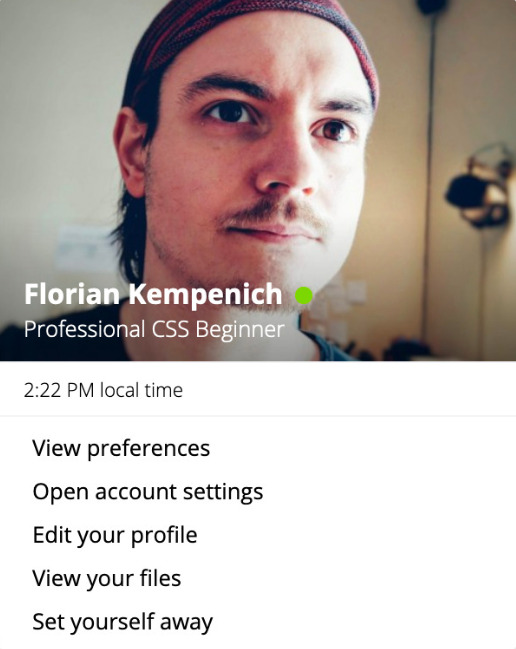
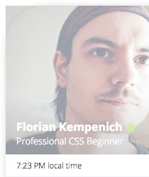

Recently I have been dedicating some time to the study of the fundamentals of HTML and CSS. A couple of days ago I wrote a blog post on [my very first Front-End Kata](/my-first-fe-kata).<!--more--> The result is this Slack-like card:



_The link to the CodePen: [Slack Card](https://codepen.io/HelloThisIsFlo/pen/xoYbrp)_

I decided to write a couple of follow up articles to share a few things I learned through this experience. It isn't mean to teach the basics of CSS, just meant to share 2 or 3 interesting pieces of info I remembered the most 🙂. Today is the first one of the series.

### Background Image With Rounded Corners

The HTML code for the Slack card looks like this:

```html
<div class="slack-card">
  <div class="header-with-img">
    ...Picture and Name...
  </div>
  <div class="time-and-date">
    ...
  </div>
  <ul class="profile-actions">
    ...
  </ul>
</div>
```

The Profile Picture is a `background-image` set in `.header-with-img`, but the rounded corners were set on the parent `.slack-card` with `border-radius`. What would happen is that while the `.slack-card` would be rounded as expected, it wouldn't clip the background image of `.header-with-img` and the image would be visible outside the boundaries of `.slack-card`.

Here is a picture presenting the problem, I added transparency and exaggerated the border-radius to highlight the issue:




What's the fix? Well, another way of describing the problem would be to say the `.header-with-img` was **overflowing** from the `.slack-card` container. The fix to allow clipping was simply to add `overflow: hidden` to `.slack-card`:

```css
.slack-card {
    ...
    overflow: hidden;
    ...
}
```

And here is the result 😃


I could see at least 2 other possibilities for solving this problem:

* Setting the same `border-radius` on the `.header-with-img`
* Removing `border-radius` from `.slack-card` altogether, and dealing with the corner rounding in `.header-with-img` for 2 top corners and `profile-actions` for the 2 bottom ones.

That being said, I wasn't a fan of the first alternative because of the redundancy it induces, and I wasn't a fan of the second one because I wasn't sure how the shadow would behave.

Either way, if you have arguments for one or the other of the alternative solutions, or maybe even a third idea, be sure to let me know in the comments or [@HelloThisIsFlo](https://x.com/HelloThisIsFlo) on X ;) 


*Until next time --- The Professional Beginner*
