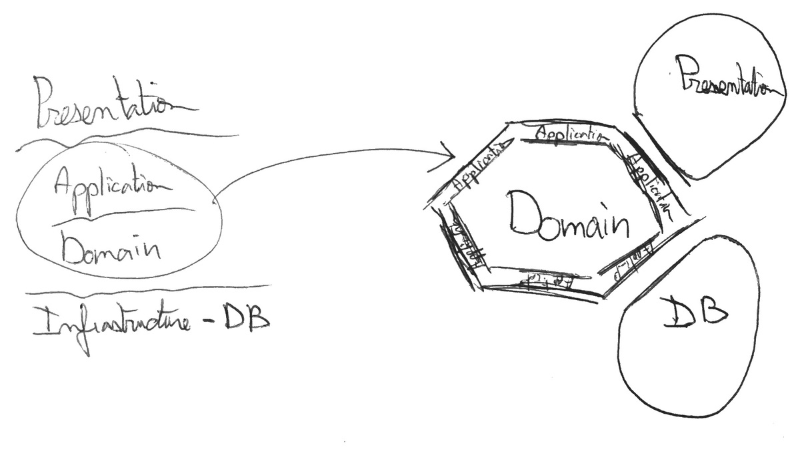
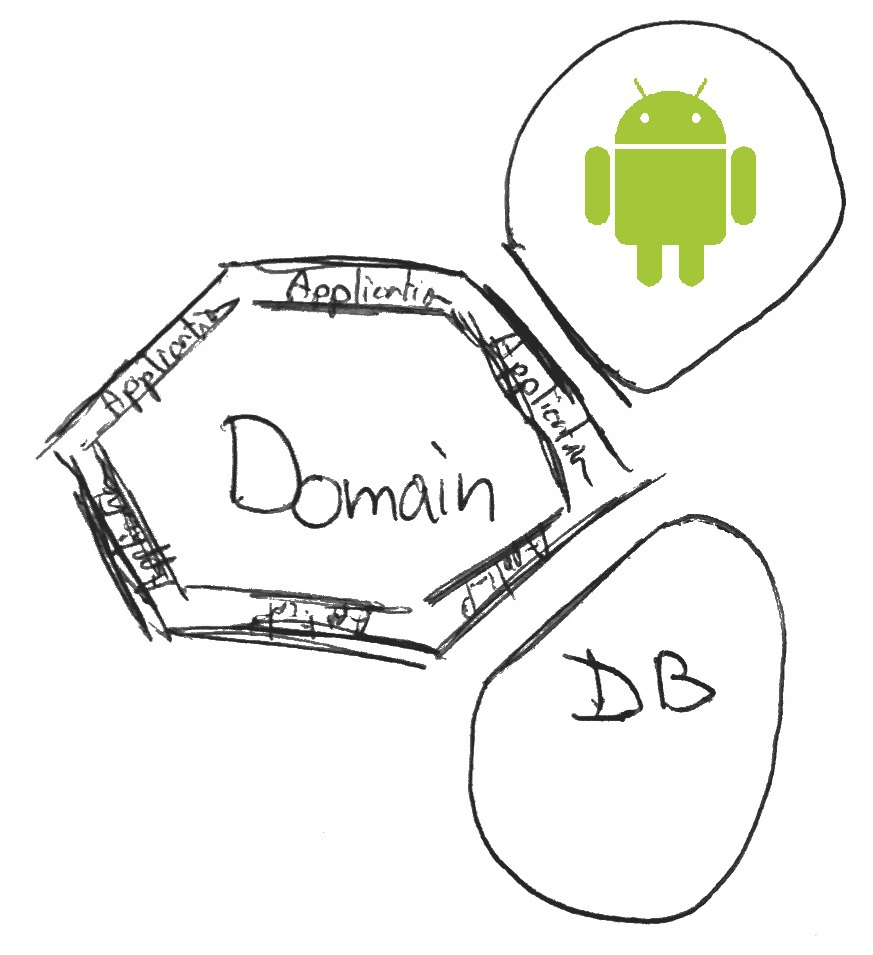

<!--more-->

> ###### Update
> After month of research, study and trial and error, I finally have a much clearer vision on modular architectures.
> I invite you to discover the result of my research in the following article:
> 
> [My Java Archetype](/my-java-archetype)
> 
> Feel free to continue reading this article, as it goes a bit more in-depth on certain aspects.
>
> I used a slightly different, more refined vocabulary in the article about [My Java Archetype](/my-java-archetype).
> To make the transitions as easy as possible between the two articles, here are the equivalent definitions.
>
> | Hexagonal Series |     | My Java Archetype           |
> |------------------|-----|-----------------------------|
> | Use-case         |     | Application Service         |
> | Driving Adapter  |     | Application Service         |
> | Port             |     | Contract (Interface layer)  |
> | Driven Adatper   |     | Contract Implementation     |

"Testing on Android is Hard", this seems to be a **widespread** idea. A lot of professional applications out there are **not** covered by tests. Even some of the samples from **Google** are not test covered. So what’s really up with **android** ? Why is it so **difficult** to test?

I mean is it really **still** difficult?
Well the purpose of this blog not being **answering** questions but rather **asking** them, let's ask ourselves this very **question**.

---

*This post is part of a series of post where I try my best at implementing the Hexagonal Architecture in an Android application.*

*You can also check out the other parts:*

- [*Part1: Introduction*](/hexagonal-android-pt1-intro)
- [*Part2: The Architecture*](/hexagonal-android-pt2-architecture)
- [*Part3: Crossing Boundaries*](/hexagonal-android-pt3-boundaries)

*The whole code for the application is available at:*

- [*Gitub repo*](https://github.com/ShockN745/TicTacToe "Tic Tac Toe")

*This series is not meant to be a complete introduction to the Hexagonal architecture, for more information check these links :*

- *[Alistair Cockburn's original Hexagonal Architecture](http://alistair.cockburn.us/Hexagonal+architecture "Hexagonal Architecture")*
- *[Fideloper's talk on Hexagonal Architecture](http://fideloper.com/hexagonal-architecture "Talk on Hexagonal Architecture")*
- *[Uncle Bob's Clean architecture](https://blog.8thlight.com/uncle-bob/2012/08/13/the-clean-architecture.html "Clean Architecture")*

*Moreover this project is very similar to the one of Fernando Cejas*

- [*Clean android by Fernando Cejas*](http://fernandocejas.com/2014/09/03/architecting-android-the-clean-way/ "Clean Android")

---

## How to make a highly testable Android Application?
What seems to be the **consensus** is that the android part is . . . **tricky**. For a multitude of reasons.

Valid or not, for now, let’s just **not** spend time trying to understand them.

**Why not?** Well if the android part really **is** the problem, there’s always the solution to . . . **abstract it away**.

By **removing all the android dependencies from most parts of the application**, it becomes **incredibly easy to then have it covered by tests**. I’m sure you start to see where I’m getting at.

## Hexagonal Architecture

Aka **Ports and adapters**, is a simple way to organize software that enables a separation of responsibilities.
If you’ve heard of the **Onion Architecture** or the **Clean Architecture**, they are basically the same idea.
Same also goes for all layered architectures, the only difference being that the **central layer** is now the **center of the circle/hexagon** and the **external layers** are **hexagon “modules”**.

This article is not intended to be a complete introduction to the hexagonal architecture, for that I’d recommend:

- [Alistair Cockburn's original Hexagonal Architecture](http://alistair.cockburn.us/Hexagonal+architecture "Hexagonal Architecture")
- [Fideloper's talk on Hexagonal Architecture](http://fideloper.com/hexagonal-architecture "Talk on Hexagonal Architecture")
- [Uncle Bob's Clean architecture](https://blog.8thlight.com/uncle-bob/2012/08/13/the-clean-architecture.html "Clean Architecture")

Back to our main topic, in our case, the UI part is the Android part.

What this means is that we have a domain that is completely **Android free**. By Android free, I really mean the domain should be **exempt of all android references**, and actually any other references too. Ideally, the domain should be POJO only.

### Tdd on the Domain

So we did it!

At least partly. With a domain now free of Android dependencies. It is now **really easy to test our android application**. It’s basically a **simple java app** now. And for that, there are tons of testing techniques available. You know what to do now ;)

I personally prefer to develop tests first. To know why, or to simply discover TDD, check out [this article](/tdd-my-hopes).

### The Android Part

So by separating concerns we got rid of most android dependencies in our application making it highly testable but . . . that’s not it.

Since it’s an android app we cannot entirely get rid of all android dependencies.
In a later post, we’ll investigate together how to make the Android part more testable

**Hint**: It’s also about removing android dependencies ;)

## Tic Tac Toe Project
That's the basic idea: **separation of concerns**. Seems simple in theory, now let's see how that turns out when trying to implement it.

During the following weeks, I will focus on implementing the **Hexagonal Architecture** in a **TicTacToe** android application.

The application in question is a simple tic tac toe game. You can check the code on [Github](https://github.com/ShockN745/TicTacToe "TicTacToe Code").

I will first give you an **overview of the architecture** I used.

But the main focus after that will not be about describing the best practices when implementing the Hexagonal Architecture on Android, but rather **exposing the problems I encountered**, the **solutions I picked** and the underlying **reasons I chose these specific solutions**. This will be under the form of [Open Articles](/open-articles)

*This is only an introduction but if you have any comments or questions, I would love to see your reactions in the section below.*

*--- The Professional Beginner*
