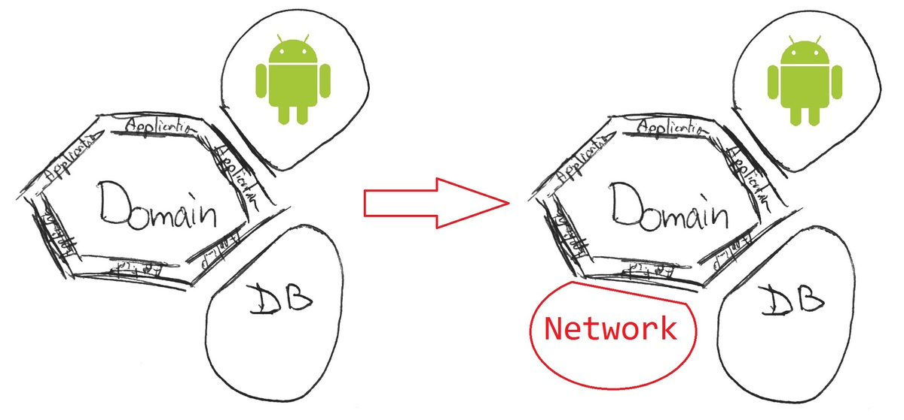
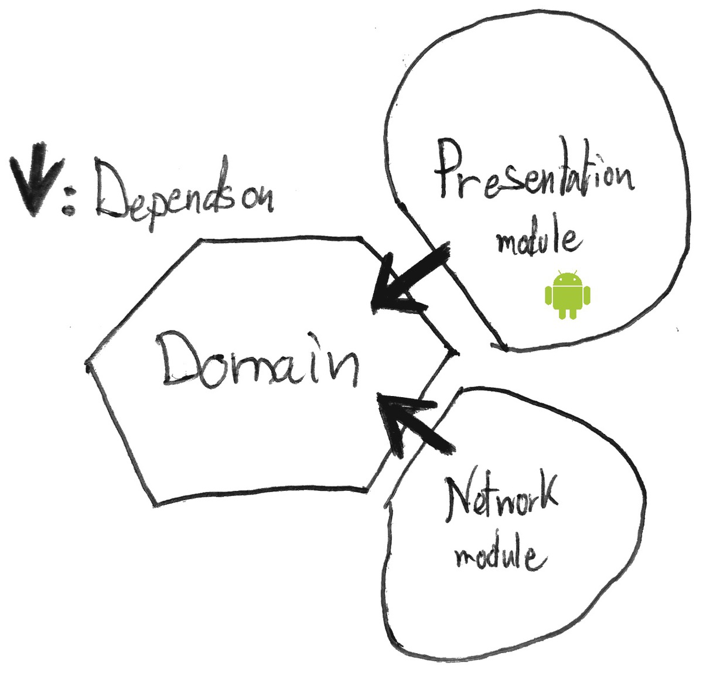
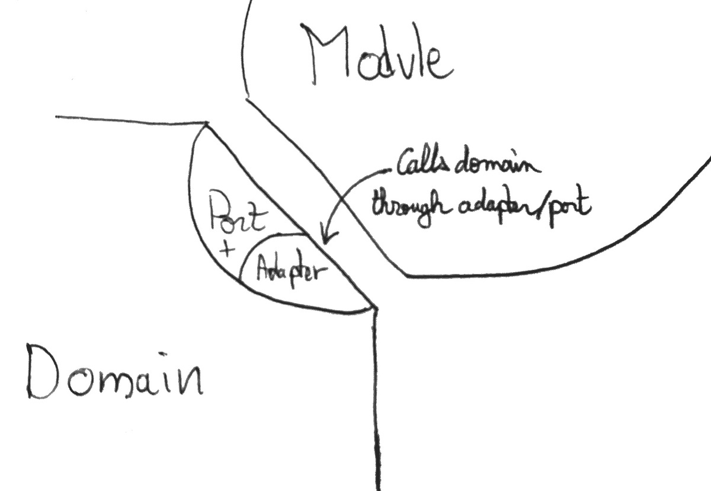
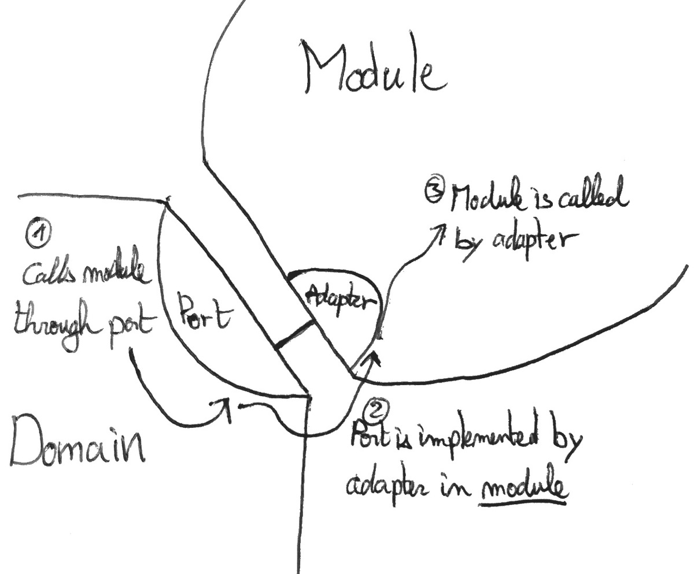

<!--more-->

> ###### Update
> After month of research, study and trial and error, I finally have a much clearer vision on modular architectures.
> I invite you to discover the result of my research in the following article:
> 
> [My Java Archetype](/my-java-archetype)
> 
> Feel free to continue reading this article, as it goes a bit more in-depth on certain aspects.
>
> I used a slightly different, more refined vocabulary in the article about [My Java Archetype](/my-java-archetype).
> To make the transitions as easy as possible between the two articles, here are the equivalent definitions.
>
> | Hexagonal Series |     | My Java Archetype    |
> |-----------------|-----|----------------------|
> | Use-case        |     | Application Service |
> | Driving Adapter |     | Application Service |
> | Port            |     | Contract (Interface layer)  |
> | Driven Adatper  |     | Contract Implementation |

Today I will talk more in detail about the **Hexagonal architecture** and more specifically how it has been **implemented in the application.**

The main idea as presented in the previous post is to **get rid of all dependencies** in the **domain**.

Well, that's more of a **side effect** really. The real idea is to have a **flow of dependencies pointing inward**: **from the Modules to the Domain**, but we'll come to that later.

For now, all we want is a domain free of Android dependencies.

---

*This post is part of a series of post where I try my best at implementing the Hexagonal Architecture in an Android application.*

*You can also check out the other parts:*

- [*Part1: Introduction*](/hexagonal-android-pt1-intro)
- [*Part2: The Architecture*](/hexagonal-android-pt2-architecture)
- [*Part3: Crossing Boundaries*](/hexagonal-android-pt3-boundaries)

*The whole code for the application is available at:*

- [*Gitub repo*](https://github.com/ShockN745/TicTacToe "Tic Tac Toe")

*This series is not meant to be a complete introduction to the Hexagonal architecture, for more information check these links :*

- *[Alistair Cockburn's original Hexagonal Architecture](http://alistair.cockburn.us/Hexagonal+architecture "Hexagonal Architecture")*
- *[Fideloper's talk on Hexagonal Architecture](http://fideloper.com/hexagonal-architecture "Talk on Hexagonal Architecture")*
- *[Uncle Bob's Clean architecture](https://blog.8thlight.com/uncle-bob/2012/08/13/the-clean-architecture.html "Clean Architecture")*

*Moreover this project is very similar to the one of Fernando Cejas*

- [*Clean android by Fernando Cejas*](http://fernandocejas.com/2014/09/03/architecting-android-the-clean-way/ "Clean Android")

---

## Domain

With a domain **java only** testing is a breeze.

But then, **what should we put in the domain really ?**

Well, anything that supports the **logic** of the application.

- Does your app need to **process** invoices? The processing logic goes in the domain.

- Need to **extract information** from a list of ... things? That goes in the domain.

- Need to **fetch** this list from a JSON API? ~~That goes in the domain~~ Wait a sec, that does **NOT** go in the Domain. I'll talk about that later.

The domain contains **all the business logic** necessary to your app. But is **free of any dependencies, android or other.**

#### What does not belong in the Domain

But now, what if we want to **fetch** a list of objects from say a JSON **API**.

Let’s face it a lot of android applications are wrappers to provide a nice UX through a Restful API.

In this case, we **wouldn’t** really want to get rid of all the dependencies and do the all the **HTTP connections and JSON processing by hand**. That seems to go really hard against the **don’t reinvent the wheel** principle.

##### The Problem

**Fetching JSON** is definitely better done when relying on some **3rd party library** for parsing the result from the API, same goes for **connecting to a server**.

Yet the domain should be **free of dependencies**: Android, other frameworks, and libraries. Also, network operations are definitely **not** part of the UI.

###### Where to put this Network module?

Well, did I say **"module"** ?

Well, I think we've got our answer!
The network module will be added as an **extra module** to our **Hexagonal architecture**.

The **domain** is still the **centerpiece** of the application.

If the network module is completely separated from the domain, and the android application part is also a different module: **How to access network data from the Android Application?**

Through the **domain** of course!

## Boundaries

The domain should present an *API* to be used by different modules.

When the **UI** needs some information from the **network** :

- The **UI** module call the API of the **domain**

- The **domain** will then *call* the **network**.

- The **domain** *dispatch* the information to the **UI**

**Simple enough**? Well, so I **thought**.

But there's a **trick**, as mentioned in the introduction an *Android free* domain is actually just a side effect, what we really want is a **flow of dependencies pointing inward**.

Following this model, there is a **problem** with the previous statement. How does the domain ***call*** the network or ***dispatch*** the information to the UI, if the domain not supposed to have **any knowledge** of the external modules?

### Ports and Adapters

The Hexagonal architecture is called the **Port and adapters** architecture for a reason.

For each **module**, communication with the **domain** is done through a **port** and one, or multiple **adapters**.

A **port** basically is what I called a **module** throughout this entire article. It is not necessarily a code entity, but rather the definition of a **point of standardized interaction** with the **domain**. A single **port** could be represented by **one or a series** of Java **interfaces** for example.

An **adapter**, is an **implementation** of a **port**.

When the UI needs to communicate with the domain, for example, it'll do so through a **port**: An interface defined in the **domain API** that's implemented by an **adapter** in the **domain**. That is called a **driving adapter**, and is the most obvious way to communicate with the domain.

Now how can the domain ***call*** the network and ***dispatch*** the information to the UI since it **should not have any dependency** on these elements? Turns out there is another type of adapter, called a **driven adapter** that allows the domain to do just that! Is is an **interface that is defined in the *domain* but implemented in a *module*.** Then at runtime, an **implementation** of this interface is injected in domain objects. Of course, the domain objects interact only with the **interface,** and not the actual implementation.

Of course, there can be multiple **driven adapter** for a **single port**. And that's also the beauty of it. This allows to **easily swap components** of the system. Need a mock representation of the network module for testing? That's just one adapter away.

###### An example

If you application requires a **list of prices** from an **API** then do the **sum** and **display** it :

- User **click** on load sum
- **UI** calls **domain** through a **driving adapter** to get the sum.
- **Domain** calls **network** through a **driven adapter** (provided in constructor)
- **Domain** perform the sum
- **Domain** calls/notify the **UI** through a **driven adapter**
- **UI** display sum

## Conclusion

To summarize, the **domain** contains all the **logic** of the application. It only handles business-related concerns and is **free of any dependencies**. It is used by/uses **modules** that depend on the **domain**. The communication between the **modules** and the **domain** is established through **ports**. The implementation of **ports** are **adapters**.

Doing the research for this article I learned **3 things** :

- What the **domain** roughly consist of
- How is the **domain** used by the **modules**
- How the **domain** uses the **modules**

In the next article of this series I will focus on: [Crossing the boundaries](/hexagonal-android-pt3-boundaries) what should cross the boundaries between layers, and how to organize the domain API to make its integration as seamless as possible. I'll also talk about the **Application layer** which I didn't mention in this article.

*If you have any comments or questions, I would love to see your reactions in the section below. The first one to learn from this blog is me, and I'm learning from you. So the more comment the better my future articles will be.*

*--- The Professional Beginner*
