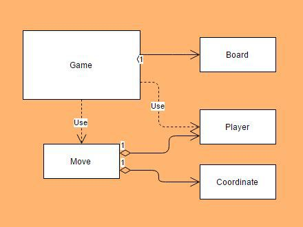
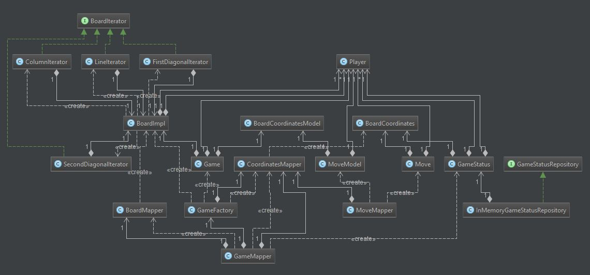
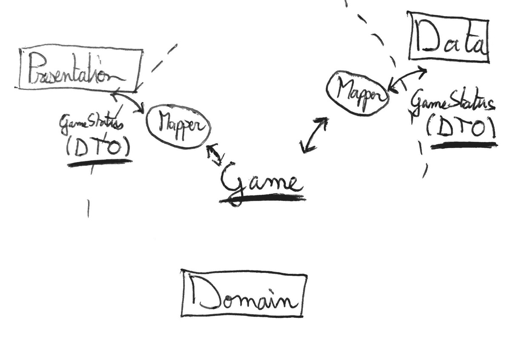
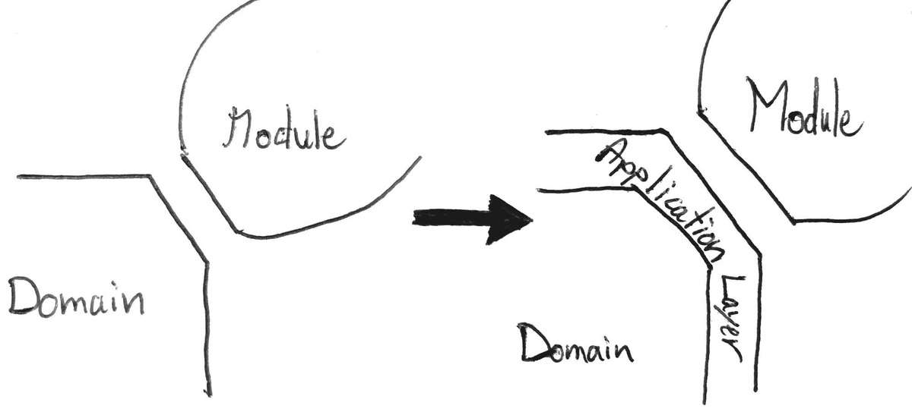

<!--more-->

> ###### Update
> After month of research, study and trial and error, I finally have a much clearer vision on modular architectures.
> I invite you to discover the result of my research in the following article:
> 
> [My Java Archetype](/my-java-archetype)
> 
> Feel free to continue reading this article, as it goes a bit more in-depth on certain aspects.
>
> I used a slightly different, more refined vocabulary in the article about [My Java Archetype](/my-java-archetype).
> To make the transitions as easy as possible between the two articles, here are the equivalent definitions.
>
> | Hexagonal Series |     | My Java Archetype    |
> |-----------------|-----|----------------------|
> | Use-case        |     | Application Service |
> | Driving Adapter |     | Application Service |
> | Port            |     | Contract (Interface layer)  |
> | Driven Adatper  |     | Contract Implementation |

In the [previous article](/hexagonal-android-pt2-architecture) I presented an overview of the basic principle behind the **Hexagonal Architecture**.

To me, that's all there is to it for the moment. Of course, I might have **oversimplified**, but it's a **good start** to get a grasp at how to organize software to respect this style of architecture. 

Now let's take a deeper look at our **domain** in the context of the **TicTac app.**

---

*This post is part of a series of post where I try my best at implementing the Hexagonal Architecture in an Android application.*

*You can also check out the other parts:*

- [*Part1: Introduction*](/hexagonal-android-pt1-intro)
- [*Part2: The Architecture*](/hexagonal-android-pt2-architecture)
- [*Part3: Crossing Boundaries*](/hexagonal-android-pt3-boundaries)

*The whole code for the application is available at:*

- [*Gitub repo*](https://github.com/ShockN745/TicTacToe "Tic Tac Toe")

*This series is not meant to be a complete introduction to the Hexagonal architecture, for more information check these links :*

- *[Alistair Cockburn's original Hexagonal Architecture](http://alistair.cockburn.us/Hexagonal+architecture "Hexagonal Architecture")*
- *[Fideloper's talk on Hexagonal Architecture](http://fideloper.com/hexagonal-architecture "Talk on Hexagonal Architecture")*
- *[Uncle Bob's Clean architecture](https://blog.8thlight.com/uncle-bob/2012/08/13/the-clean-architecture.html "Clean Architecture")*

*Moreover this project is very similar to the one of Fernando Cejas*

- [*Clean android by Fernando Cejas*](http://fernandocejas.com/2014/09/03/architecting-android-the-clean-way/ "Clean Android")

---

## Domain in the TicTacToe App

After few iterations of [Test Driven Developement](/tdd-my-hopes) the resulting domain looked like this.

- The **Game**: the centerpiece of the domain. Where all the moves are played
- The **Board**: Add moves to the Board, and validates them beforehand. Also provide iterators to iterate through column, row, diagonals.
- The **Coordinate**: Represents and validates coordinates
- The **Move**: Represents and validate move
- The **Player**: Represents and validate a player

So far nothing really complicated. Our **domain** is composed of fairly **simple elements** that go together in quite a **simple manner**.

At this point I **thought** I could just:

- **Create an instance** of the **Game** object in the **Activity**
- Use it to keep the **state** of the game
- Create new **moves** and **player**.

Basically **exposing all the components** of **domain** to the **presentation** layer.

Doing this I would respect the principles of the **hexagonal architecture** right?

- All **logic** processing would be done with **domain** objects.
- There is **no android dependency** in the **domain**, as a matter of fact there is **no external dependency** at all in the **domain**.

Yet that just **didn't** quite **felt right**!

All this **decoupling** work to now use the **domain** as if it were only from a **different package**. Sure we've achieved the **greater goal**: All the logic of our application is now well **tested**. But yeah something just did not **feel right**, not enough **separation of concerns** to my taste.

## Crossing boundaries
So I did my **research** and started to **try and understand** what should really be at this **boundary**. And what **kind** of objects should **cross** the boundary.

Turns out this was the source of a big headache and a good conversation with a fellow craftsman.
>Since I'm not 100% sure that the solution I decided to adopt in the end is the definite right one: this whole section deserved it's own Open-Article, which you can find here: [The DTO dilemma](/the-dto-dilemma)

But **for now let's assume I did pick the right solution** after all.

The bottom line is: Only **DTOs** should be allowed to cross the Border. With that in mind our **simple model** changed . . . just a **tiny bit**.

Yes, the picture is **intentionally** un-readable, but the point is it gets way more **complex**, at least in **appearence**. I am not going to go over the whole process here. Check the [previously mentionned](/the-dto-dilemma) article for that. But the basic **idea** is:

###### When creating a new Game:

- A new **Game** is Created from the game **Factory**
- This **game** is mapped to a **GameStatus** by the **GameMapper**
- The **GameStatus** is stored in a **Repository**, an **id** is returned
- The **Id** is used to access the **Game**

###### When adding a move to the new Game:

- A **GameStatus** is retrieved from the **Repository** with the **Id** generated at the initialization
- The **GameStatus** is mapped to a **Game** by the **GameMapper**
- A **Move** is played on the **Game**
- The updated **Game** is **Mapped** again to a **GameStatus**
- The **GameStatus** is stored in the **Repository** using the same **Id**
- The same **GameStatus** is used to display the informations of the Game.

Well that does sound a lot more **complicated** than just creating an **instance** of the game. But is it **really** ?
Sure it doesn't look ***obvious***, but if we decompose the steps is it really **complicated**, or just . . . ***complex***?
When I think about it: It all boils down to a ***complex*** sequence of fairly **simple** operations.

The point is that now **domain objects** do not cross the domain's **boundaries** anymore.

### Keep It Simple, Stupid

Now we have a wonderful **domain API** with only **Factories**, **Repositories** and **DTO** crossing the border. A bit better in terms of **separation of concerns**, but still not entirely satisfying when it comes to **encapsulation**.

As a **user** [of the domain] I do not want to be polluted with **persistence** concern.

Plus if we were to actually execute the **processes** described above in the **Activity** (Presentation layer object): We'd have the **same problem** as before. The **presentation layer** would have **access** to the core **objects of the domain** (Game, Board, etc).

To solve both the problem of **objects ownership**, and **simplify** the domain API, **another layer** is introduced. It sits just at the **border**. It is the **Application Layer**.

> Note: As of today this is my first project with a clear separation of the domain. I have yet to explore the proper way to code the domain. So, I have at the moment no idea about entities, services, and other domain-related concepts. I am after all the Professional **Beginner** ;) (And yes Domain Driven Desing by Eric Evans is already on my bookshelf)

## The application layer

The Application Layer is just at the **border** between the **domain** and its **consumer**. That's where the **driving** adapters belong.
That's also where I decided to put the **interfaces** for the **driven** adapters.

Its **role** is to use objects of the **domain** to create an **easy to use** interface for the **consumer**.

I'm sure there are **multiple ways** to approach this particular layer of our application. But as a matter of personal preference, I decided to focus on an implementation that is my interpretation of a concept made popular by **Robert C Martin**, and originally presented by **Ivar Jacobson** : A Use-case driven approach.

### Use-case approach

The idea as presented in this [blog post](https://blog.8thlight.com/uncle-bob/2012/08/13/the-clean-architecture.html) and this [talk](https://vimeo.com/43612849) by Uncle's Bob, is to have a couple of **Interactors** taking care of the **orchestration** of operations in the domain to realize a specific **use-case**.

And **That** is what I have been looking for the better part of this article.

In the **TicTacToe** project these **Interactors** are called **(something)UseCase** but the idea remains the **same**.

For every **action** on the domain, a specific object is created whose one and only task is to execute this very action. For the TicTacToe application there is 2 UseCases: **InitNewGameUseCase**, and **AddMoveUseCase**

They are the **perfect answer** to what I was looking for because:

- They **orchestrate** objects of the **domain** to create a **seamless API**
- Allows the **modules** to communicate using only through **DTO**
- They still **belong** to the **domain**

From now on, whenever a new game needs to be created, or a move needs to be added. The interaction is reduced to a **single call** to a UseCase Object.

###### When creating a new Game:

- Call the *execute* method of the **InitNewGameUseCase**
- The **ID** necessary to take further actions on the game is retrieved through a callback previously provided to the use-case.

###### When adding a move to the new Game:

- Create a new **Move**
- Pass it to **AddMoveUseCase**

The **AddMoveUseCase** takes care of fetching the correct **GameStatus** from the **repository**, do the **mapping**, execute the **move**, re-maps the **Game** to a **GameStatus** and returns it to the **consumer** through a callback previously provided.

## Conclusion

Oddly what took me quite some time to wrap my head around how ***use-cases*** could be represented as concrete classes. To be honest I'm still **skeptical** that the way I handled things for this TicTacToe project is the **absolute correct way**. I guess it'll either become more obvious with time, or I'll update this article once I have a deeper understanding of the Application layer.
About this very problem, thanks again to [Fernando Cejas](http://fernandocejas.com/2014/09/03/architecting-android-the-clean-way/) for making it real clear how use cases could be represented.

This part was the **trickiest** for me to implement but here's what I **learned**:

- Only **DTO** should cross the **boundaries** between layers (after dependencies injected)
- There is an **extra layer** surrounding the **domain** whose role is to **orchestrate operations** on the Domain
- Implementing real **use-cases** as **concrete classes**, streamlines the domain interface and allows standardized communications

*As mentioned this section is the one that gave me the most headaches. So if you have any comments that could help me understand better that part, I'd love to hear from you. Same goes if you liked this article ;)*

*--- The Professional Beginner*
