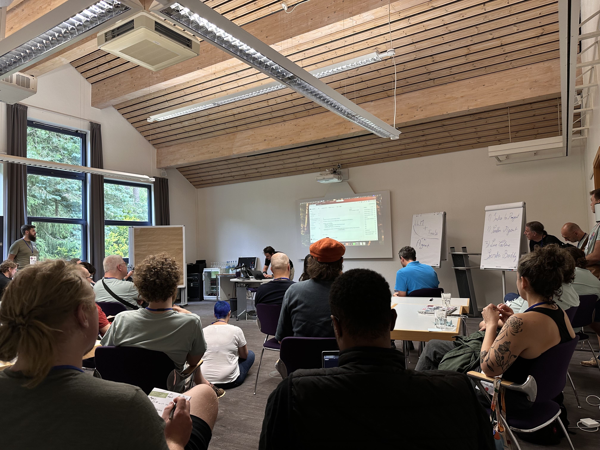
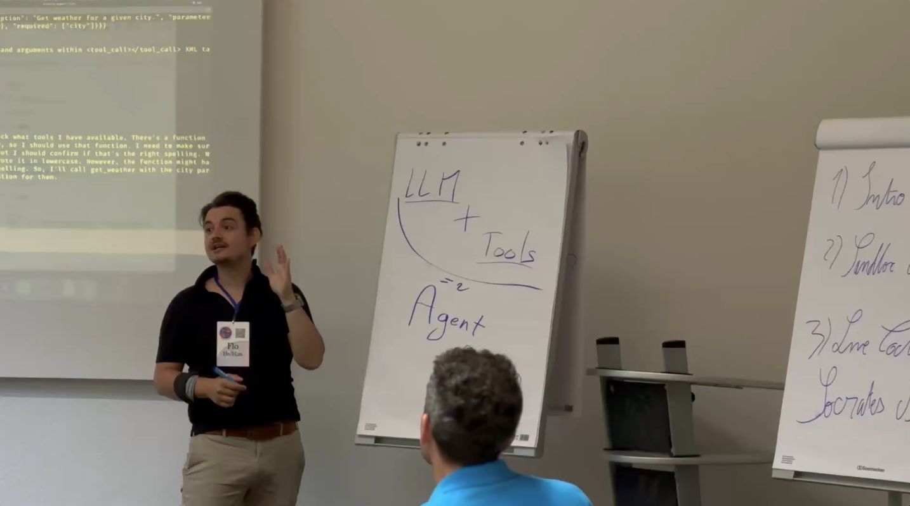
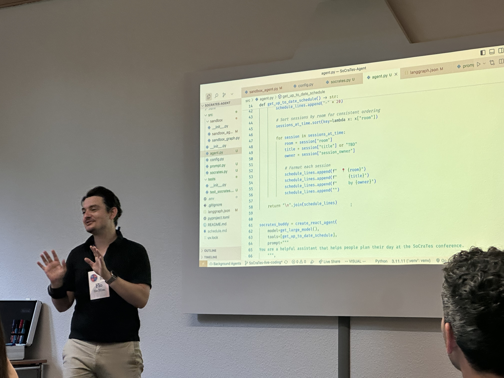

> "We're essentially mentoring the AI through the prompt."

<!--more-->

So here's what happened. I was at SoCraTes Germany, a conference I've been going to for seven, eight years now, and I was watching people walk up to the board to propose sessions. And I was sitting there thinking: I should propose something on AI agents. I've spent the past year going deep on this stuff. I built a multi-agent system at work. I had weekly sessions with my friend Toni where we'd just... explore the space together for months. I had things to say.

The problem was that I had prepared absolutely nothing. Not "I had some rough notes." Nothing. Life had been a lot (understatement of the year), and the preparation I kept telling myself I'd do just never happened.

And there was a second problem. The SoCraTes community has mixed feelings about AI, and I was genuinely afraid of being the person who walks in and starts evangelising about agents at a conference where the general mood is, let's say, cautious.

But the morning energy was good. And at some point I just thought: f*ck it. I'll figure it out.

I walked up and proposed the session without knowing what I was going to do in it.

### The idea

Right before going up, I had asked my friend Ajit, one of the organisers, how the schedule works. Turns out the whole conference schedule sits on a public URL. No auth, no API key, just the data. And if you've been to SoCraTes, you know the schedule board situation: people crowding around it, taking photos on their phones, trying to figure out what overlaps with what.

Public API. Real problem. A room full of engineers who've (mostly) never seen an agent built from scratch.

I grabbed Toni and we built the whole thing in about two hours. A scheduling assistant for SoCraTes. You ask it "what's on this afternoon? I'm interested in testing" and it comes back with a personalised plan, flags conflicts, suggests alternatives. One system prompt, one tool (a scratch pad for your personal schedule), and the full conference schedule loaded fresh before every message. With maybe 200 attendees, dumping the whole schedule takes milliseconds, so there's no need for anything clever.

I committed working checkpoints to a branch as I went, because live demos break and I wanted a fallback. The SoCraTes crowd would appreciate that kind of thing.

### The session

About thirty people showed up.

At a conference where the community is cautious about AI, thirty experienced engineers came to hear about agents. And people kept arriving after we'd started, which, at SoCraTes, means something. There's this cultural norm called the "law of two feet": if a session isn't working for you, you leave. No drama, it's encouraged. So when people keep walking *in*, that's a signal.

I spent the first half at the whiteboard. No code, just fundamentals. What is an agent? (For this session: an LLM that can call tools.) What is a tool? (A callable function.) How does conversation memory work? That last one is the one that gets people. When I first learned that every message sends the entire conversation history, it was a genuine "wait, really?" moment. So I made sure to explain it properly, because I think that's where the demystification actually begins.

I set definitions early and explicitly. "I know there are other definitions. I know tools aren't always JSON. I know external memory exists. But my goal here is to demystify, so let's work with these." That helped keep the session focused, and after a few minutes the questions really opened up into genuine curiosity.

One thing I said that seemed to land: "We're essentially mentoring the AI through the prompt." For a community that cares deeply about craft and mentoring and clear communication, I think framing it that way made the whole thing feel less alien. It's not a black box doing magic. It's you, teaching something to be useful. And you already know how to do that.

### The live coding

Then the live coding. And yes, it broke (of course it broke). I laughed, fell back to a checkpoint, got it working. You know how it goes.

> "Oh, but that's so simple."

The reaction I found most interesting came after it was working. A few people said something like: "Oh, but that's so simple." Almost... disappointed? As if the simplicity was somehow a flaw.

And I think that's the thing I keep coming back to. The code *is* simple. But look at what it does. You ask a question in plain language about a real conference schedule and get a personalised, conflict-aware answer. That's not nothing. And the fact that the code is simple? That's... kind of the whole point. You can't improvise a conference session and build something useful in two hours if this stuff was actually complicated. The improvisation is the proof.

### What happened after

The session was supposed to be one hour. When time was up, I asked if people wanted to stop. Almost everyone wanted to keep going. We ran close to two hours and only stopped because someone else needed the room.

Afterward, I put the agent on a shared link with my own API key (£30 spending limit, never came close). People actually used it for the rest of the conference to plan their days. I could see the requests coming in, and knowing that this improvised thing had become something people actually enjoyed using... that was probably the best part.

### Next year

If I do this again (and I'm planning to) I'll have the agent live *during* the session. QR code on the screen, everyone tries it on their phones while I'm explaining. Even if we run over, the tool is already in people's hands. That's the one thing I'd change.

But the engagement, the excitement of people coming up to me afterwards, and that feeling of sharing something I genuinely love exploring... that, I would not change.

---

*Photos by Mari, the most supportive partner I could ask for. Thanks to Toni and Ajit for being great friends, and for the help and the tip that made this whole thing possible.*
