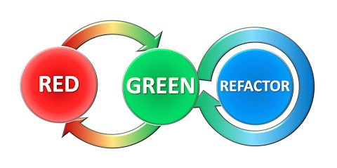
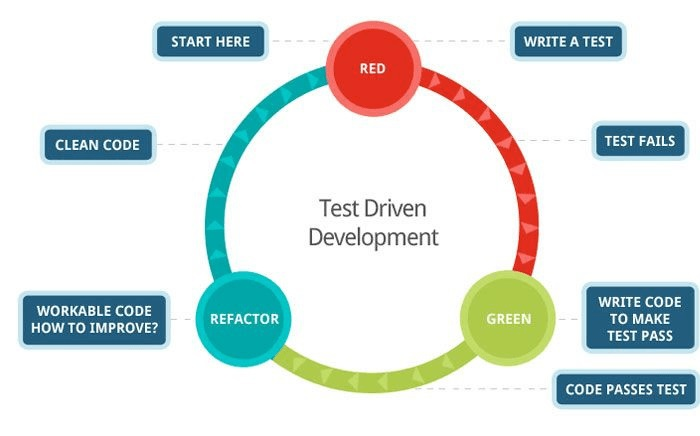

As you might have **noticed** in my "[Learning path](/my-learning-path)" article, the **first part** of my studies is focused on **TDD**. For a couple of months, I dedicated my time to the **practice** of this discipline, and you might have wondered **why**<!--more-->. Why such **emphasis** on something that, in the end, is only a **practice**, and is not really related to any architectural concepts of **clean object oriented code**?

Now, I know that **TDD** can be quite **controversial**. Some live by its **principles**, some are more **dubitative** let's say. My goal with this article is not to convince you that **TDD** is the way to go. I just want to lay down the **benefits** I got from it.

I'm not here for the **hype**, I really have my **hopes** for **TDD**. Will it live up to my **expectations**?

##Tests are boring, TDD is amazing

We all have that feeling that writing tests is a **boring**, repetitive and not productive task. Yet when I practice **TDD**, **never** have I had this sentiment of uselessness. In fact, it's quite the **opposite**. It feels **amazing!**

At the very **beginning** of my journey in January, I had 2 **major issues**. They were the 2 reasons **preventing** me to efficiently study advanced concepts of Object Oriented programming.

- **Lack of confidence** in my code
- **Non-productivity**, or at least the feeling thereof.

**TDD** solved both these problems for me.

##Imperfectionphobia

If you've read my "[About me](/about#my-short-story)" section. You may see what **drives** me in this adventure. I always wanted to do things the **right** way. The **problem** comes with the fact that: In programming, I could try my **whole life** trying to do something **the** right way. Because there is **never** such thing. A right way **among many others**, for sure, but a **single absolute truth** . . .

And yet, as a fool, I was trying to **reach it**.

#####The result ?

For every line of **code** I would write I would spend **hours** reading StackOverflow **posts**, blog **articles**, **source code**, to try and identify what the **line** I've just written **fundamentally does**.

. . .

Ok, maybe not ***every*** line. But you've got the idea.

The problem **never was** the time spent reading about different problems and solutions. I **learned** a lot doing that, and actually keep doing it on a **daily basis**. No, the problem is that most of the times I was **afraid** of missing the point. I was afraid that the piece of code I've just written would **fail** miserably in an **edge case** I wouldn't have covered.

###The edge case monster
So what would happen is, I would:

- Write a fairly **simple** piece of code
- Check if there is a **better** way to do it
    - Alternatively, check if there isn't something I **misunderstood**
- **Implement** my latest findings
- **Iterate** over this list

Without any kind of **damage control** you can imagine how this would look like after even a few iterations. **Big, ugly, and ready to explode**.

**No big deal!** At this point, I would start over with all my **newly acquired knowledge**. I would do something **simple** again. . . . **Except** then I would:

- Quickly **check** I didn't **forget** anything
- **Add** what I inevitably **forgot**
- . . . **Iterate** over this list

Yep, that **wasn't helping**. But I didn't know **better**.

Then I heard about **TDD**.

##Red, green, refactor

The **basic principle** of **TDD** is fairly simple. It's **3 simple steps**: Red, Green, Refactor.

- First, write a **failing** test.
- Then write the **single easiest** piece of code that would make the **test pass**
- Finally **refactor** to make the code **cleaner**.

Don't be fooled by the apparent **naïveté** of this process. Its **simplicity** is the very thing that makes it so **powerful**.

>To know more about the fundamentals of TDD I can only recommend this great book [Test-Driven Development by Example](http://www.amazon.com/Test-Driven-Development-Kent-Beck/dp/0321146530 "Amazon link") by the "rediscoverer" of TDD, [Kent Beck](https://en.wikipedia.org/wiki/Kent_Beck "Wikipedia")

Let's directly skip to the **last** and most **important** part of the cycle: **Refactor**. Writing the failing test and then making it pass, are a great way to get some fast **progress** and get going at a **stable** rhythm. But the real **magic of TDD** is in the **refactor phase**.

The result of the first 2 phases is a **Test Harness** that ensure the consistency of a method, class, or system. They create a set of tests that **guarantee** that when they are **passing**, no matter the changes in the implementation, the system **behaves as originally designed**.

Since, with **TDD**, tests are **not** written to validate an **existing** behavior, but rather constitute the **pure description** of how a system was **intended** to behave. That means: if all the tests are **passing**, the system irrevocably realize the **intended behavior**.

And that is when I am talking about **Magic**. Because, pushing one step further, being covered by a **test harness** means that I can refactor **AT WILL** without the fear of breaking anything.

###The real of creativity
This maybe the most important reason for my interest in **TDD**. Once the **Test Harness** is in place and refactoring is **safe**, we enter the **realm of creativity**.

This is where I can try different **approaches** for the same problem, experiment with **design patterns**. Basically, this is where all my **learning** happen.

######In the end for me the TDD cycle looks more like this

In this test-covered **Heaven**, everything is beautiful. But there is **one** thing that could quickly turn it into **Hell**. **Breaking** too many tests while **refactoring**. When this happens, reaching the **green state** again can be a **Nightmare**. That is why the **second** part of my [studies](/my-learning-path) is focused on **incremental** refactoring. I might do an article on the topic at some point in the future.

###The era of Quantify self
The other problem I mentioned I had before my discovery of **TDD** was my lack of **productivity**. Indeed as explained in the [previous section](#the-edge-case-monster "The edge case monster"), I would **waste** a lot of time looking into deeper and deeper options, only to realized I was **lost** in the end. **TDD** definitely **solved** that.

**But that's not it!** If you know me in real life, you know I love to **track** everything. I **track** my activity, my food, my work hours, my learning progress (you're reading it). **Why?** Because it makes me more **motivated**, more **productive**. By **abstracting** away the notion of **progress** into a **tracking system**, and **removing** it from my **thoughts**. I can fully **focus** on my **work!** And then when **necessary**, and only then, I can take a look back to do a **retrospective analysis** backed by the collected data.

Where am I getting at? Well, the **Test Harness** created by **TDD**, not only provide me with a fantastic **safety net** for **refactoring**, but also is a physical **indicator of progress** towards the **complete system**.

**Defining** the **behavior** of a system in terms of **tests**, allows for a very fine **tracking** of progress towards the **realization** of the project. And again this might just be only me, but personally, I cannot find anything else more **motivating** than that.

###A Flawless system

Now am I saying that **TDD** by itself produces **flawless** systems? **Absolutely not!** But what I am saying is that if the **test harness** is here and enable **refactoring** at will. Then, a **bug** in the software, translate into writing a new **failing test**.

Doing so **further specify** the **behavior** of our piece of software, including its behavior in specific edge cases.

Then, the **TDD** process kicks in, a so called ***quick-fix*** is written and with no further delay **refactored** into proper clean code, thus reducing the growth of **technical debt**.

## #NoSilverBullet

After reading this article I'm sure you're thinking **TDD** is **amazing** and want to **get started** right away. Well if that's really the case, great! Take a look at my [reading list](/my-learning-path#my-learning-path), to get some resources on the topic.

However **nothing** ever is perfect, and the path to **mastering TDD** is a long and treacherous journey. If you start practicing **TDD** with no prior knowledge you will find that practice is, as always, ***trickier*** than theory. Starting to write tests first requires a certain period of **adaptation** to actually getting any **benefits** from it.

Furthermore, I mentioned earlier that **breaking** too many tests at once while **refactoring** can transform the **TDD** experience into a **nightmare**. This could also come from a **Test-Harness** modeling the behavior of the system in a way that's **too close** to its actual **implementation**. There is a lot of **debates** about white box testing vs black box testing, Classicist vs Mockist, Chicago vs London style, Inside out vs Outside in, Depth-first vs Breath first . . . . .
A **LOT** of debates, and opinions.

But my point is **not** to enter those details. I just wanted to **share** with you why I'm so **enthusiastic** about a testing technique, and why I wish I could use it more **often**.

###An ongoing journey
Yes, I **wish** I could use **TDD** more **often**. What that means is that, there still is some **situations**, where I simply do not see **yet** how apply TDD. I'm **convinced** that it is possible, I just don't yet know how. I guess that's why I'm the ***professional beginner*** ;) Therefore, I will continue to post about TDD, but most likely in an [open article](/open-articles) format.

That **concludes** this very long article. Thank you for keeping reading until this point. You're the best ;)

*Now it's your turn, I would love to hear your thoughts on TDD. Have you tried it, do you practice it on a daily basis? How did that work out for you? Let me know what you think in the comment section below.*

*--- The Professional Beginner*
