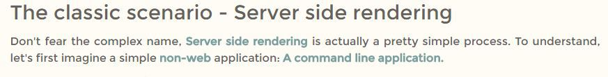
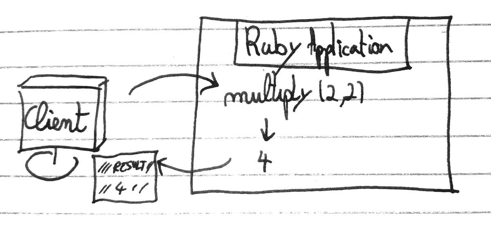
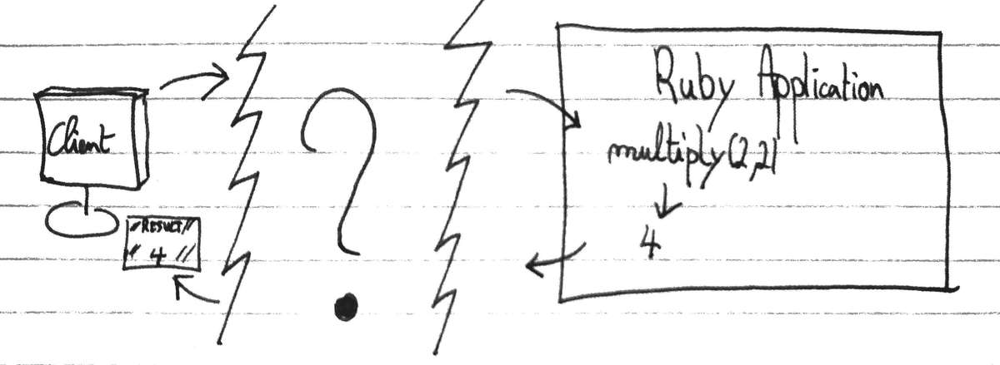
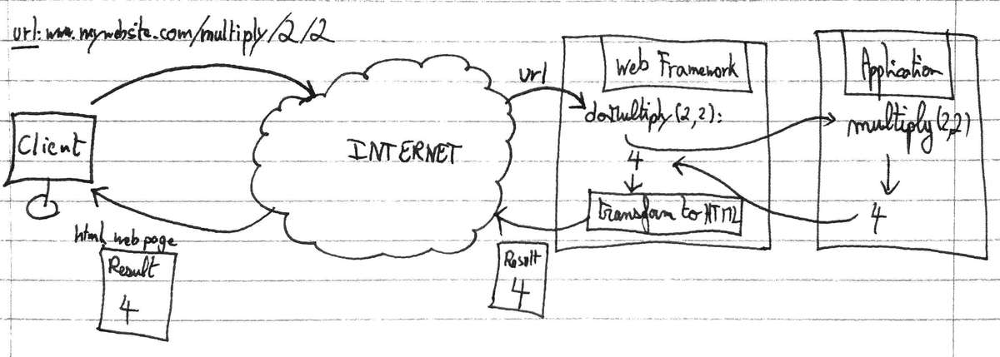
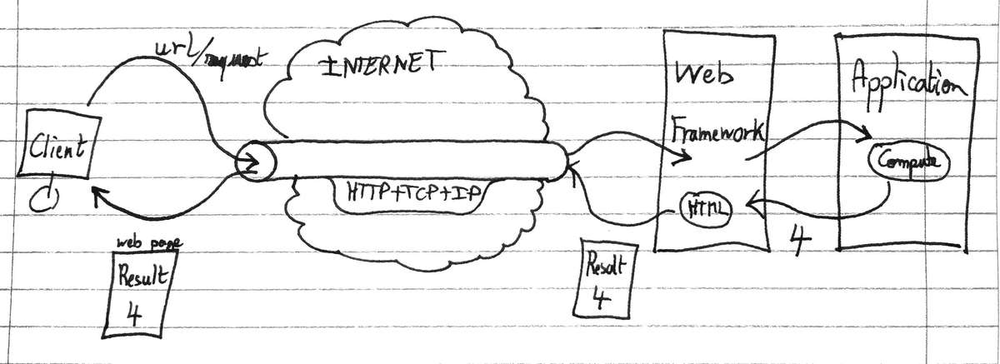

The web is a magnificent place. Where ideas come to life and where everything seems so easy to access. But when we take a closer look at how exactly do we access content on the internet, things quickly get overwhelming.<!--more--> This series of article aims at simplifying and explain how a website is made accessible, how the web works?

 - How does a server **communicate** with a client?
 - How can a client **request** content from a website?
 - What is **sent** over the network?

There are mainly 2 ways of doing things, but today let's start with the basics and present the original, classic way: **Server-side rendering.**

*The second part of this series is just there: [The Web Pt.2](/the-web-pt2)*

##  Server-side rendering

Don't fear the complex name, **Server side rendering** is actually a pretty simple process.
But in order to understand it, let's first backtrack a little bit. 

Imagine a simple **non-web** application: **A command line application.**

###  Before the web

###### How would you display information to the user?

1. The application would produce some data (Do some computation, fetch files from the disk ...)
2. **The result would be formatted**
3. The result would be printed to the output

In a **command line** application, formatting the result would mean using a combination of spaces and tabs and pipes to make the result human readable.

###### Application
~~~ elixir
def multiply(a, b), do: a * b

def main(args) do 
  {a, b} = read_from_command_line(args)
  result = multiply(a, b)
  
  print_human_readable_result({a, b}, result)
end
~~~

###### Human readable result
~~~ bash
####################
###     RESULT    ###
####################

// Hello, I am a human readable result! //

Computation: "2 * 2"
|> Result: 4
~~~

Well, a **web application** using **server side rendering** works exactly the same way!

The only part that changes is **how** the result is formatted. Instead of using a combination of text characters to make the result look readable there is a tool specifically made for that: **HTML & CSS**

###  Formatting

The role of **Html & CSS** is nothing more than to format the information to display it to the user. **Html** defines the **structure**, and **CSS** defines how to "make it **look** beautiful".

If you have no experience and are interested in learning more about Html and CSS, there are many great resources on the web. Just keep in mind, there is nothing complex about it. Don't by afraid by the syntax: At its core HTML & CSS are simply a way to **display the information in a human pleasing way.**

This blog article, for instance, uses HTML and CSS to transform this:
~~~ markdown
The classic scenario - Server-side rendering
Don't fear the complex name, Server-side rendering is actually a pretty simple process.
To understand, let's first imagine a simple non-web application: A command line application.
~~~

Into this:

###  Printing the output

After the result is formatted, just as for the command line application, the result is sent to the **output** that will **print** it.

Except that for a website the **output** is the **client browser**. The browser then simply has to interpret the result and print it to the user. 

And that's what **browsers** do: **Intepret HTML and print it**.

###  The missing link

Ok, let's sum up what we've seen by now.

When accessing a **server side rendered** website, here's what happens:

1. The client ask the server for a specific page
2. The server reacts by processing whatever is needed
3. The server **formats** the result using HTML and CSS
4. The server sends the result (HTML&CSS) to the client
5. The client browser displays the webpage

However, there is another difference between a command line application and a web application, beyond formatting the output: **The remote aspect.**

On a local command line application, both the user and the application are on the **same machine**

However with a web application, the user and the application are in 2 **different geographic locations**

A few questions then come in mind:

 - How exactly does the client **asks** something to the server
 - How does the server **responds?**
 - How a piece of Java, Ruby, C# is **executed** when the client asks for a web page? 
 - How does that response is then **formatted and sent back** to the client?

How do you connect your application to the web?

####  The web-frameworks, and other jargon

You've probably heard of Rails (Ruby), Django (Python), Spring (Java), and maybe you even know they are web-frameworks.

Well, the **web-framework** is the missing link. The web-framework is what allows your application to be **connected** to the internet.

When a user connects to a URL, the web-framework will take care of **mapping** this **URL** to a **method** call you can customize. From there, all you have to do is **call your application**.

Then after receiving a result from your application, you can **format** it with HTML&CSS, and hand it over to the **web-framework**, which will take care of **sending** the result to the user.

##### HTTP, TCP, IP

In this article I will not delve deep into how **HTTP, TCP, and IP** work. What really matter is what they achieve when they are **combined together**.

Together, they create a **tunnel** through the internet that **connects the user directly to the application** on the remote server. Or more specifically, to the web-framework.

A simplistic but practical representation of what they each do is: 

 - **IP**: Locates the server on the internet
 - **TCP**: Locates the application on the server, and provide a communication channel
 - **HTTP**: Uses this TCP channel to transmit information

####  Almost there

At this point, we now have a pretty good idea how a server side rendered web application works. However, there are still 2 points I'd like to cover in this article.

##### Template engine

When I mentioned earlier that the result of an operation was **formatted** using HTML&CSS. I didn't explain **how** that was done in practice.
Sure we could concatenate a set of strings to create the desired HTML result. But obviously, there is a better way, a simpler way.

Comes into play the **template engine**. The template engine simply allows you to define **HTML templates** with "holes" in it.

###### The template
~~~html
<!DOCTYPE html>
<html>
<body>
  <h1>This is the result</h1>
  
$$$$$$$

</body>
</html>
~~~

Then all you have to do is to hand over to the template engine the **template** as well as the **result to display**, and the **template engine** will take care of filling the holes.
~~~html
<!DOCTYPE html>
<html>
<body>
  <h1>This is the result</h1>
  
4

</body>
</html>
~~~

##### Javascript
All this time we have been talking about how websites work, how servers process requests, how HTML web pages are interpreted by the browser. 

And yet **we did not mention** a single time: **Javascript**. The #1 language on the web.

Why is that? Well because on a **server side rendered** application, Javascript is arguably unnecessary. It is useful, however.

**Javascript** is a language that is **sent**, along with the HTML&CSS web page, **to the client.**
Javascript is exectued on the **client browser**.

###### The problem before Javascript
With our current model, **each click** of the user generates a **web request** to the server. The server then generates a **new page** and sends it back to the client.

That would mean that the smallest interactions would require to **reload** another page.

###### The solution with Javascript
To allow **interaction with the page itself**, without creating a new page, **javascript** runs on the **client browser** and allows to **modify the structure of an existing page**.

Now if we want to **expand** a menu for instance. There is no need to request a new web page with the menu visible. We would delegate this action to **Javascript** which would simply make the menu visible on the existing web page

~~~html

                                    |
Javascript: when clicking menu, do: | 
                                    V

~~~

###  The Big Picture

This concludes the first article of my 2 part series on how the web works.

In this article, we understood how the tsunami of **technical words**, such as HTTP, Web-Application, Web-Framework, Javascript, **UNITE!** And how together they morph into a coherent way to make applications and content available through the internet.

In the [next part of this series](/the-web-pt2) we will push even further the **interaction** with the web page, and how the modern web works.

My goal was to make simple what took me so long to achieve: Get an idea of the **big picture** of the web.
I hope these articles are helpful to you in some way.

*If you have any comments or questions, I would love to see your reactions in the section below.
The first one to learn from this blog is me, and I'm learning from you.
So the more comment the better my future articles will be.*

*--- The Professional Beginner*
