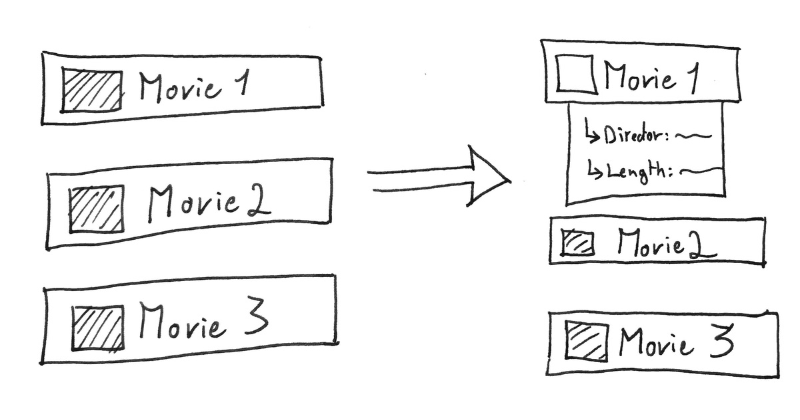
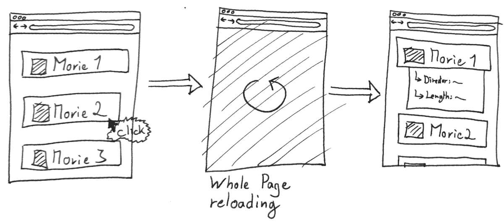
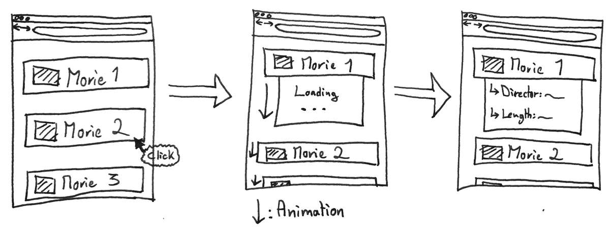
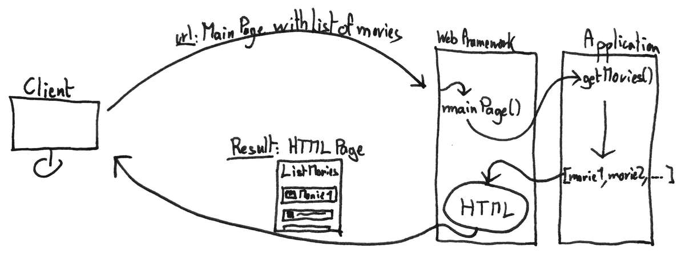
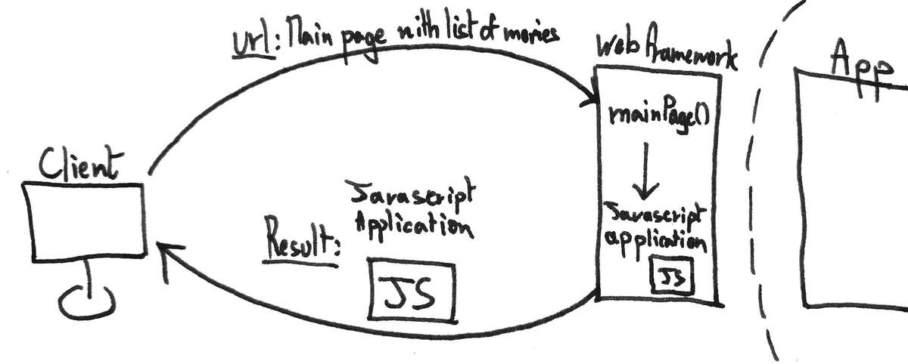
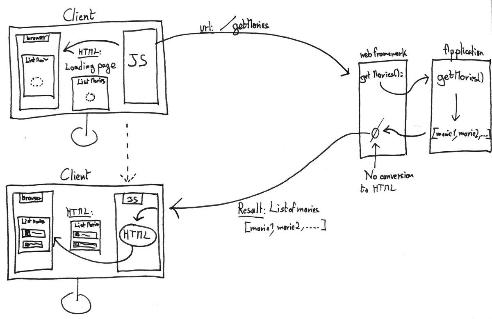
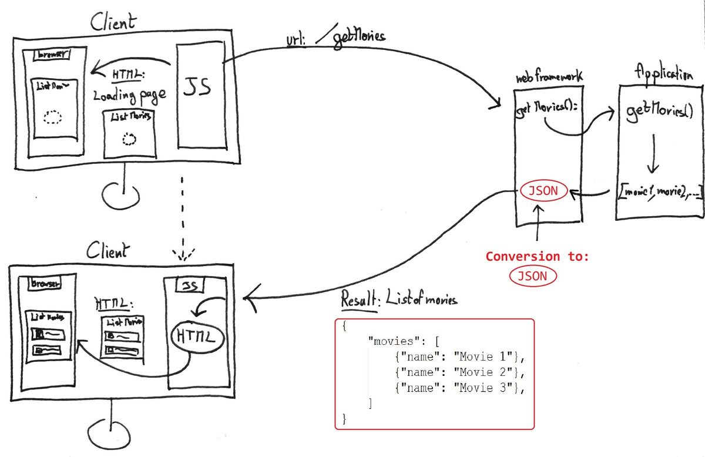

The web is a magnificent place.
Where ideas come to life and where everything seems so easy to access.
But when we take a **closer look** at how exactly do we access content on the internet, things quickly get **overwhelming**.<!--more-->
This series of article aims at **simplifying** and explain how a website is made accessible, **how the web works**.

In the first part of this series I presented **server side rendering**, go check out the [previous article](/the-web-pt1) if you missed it.
Today I will introduce the second way of doing things.
A newer, cooler, more hyped way to do things: **Client side rendering**.

Client side rendering offers a **better UX** (User eXperience), make **single page website** a reality, no more page refresh. 
And on top of that it enforces **separation of concerns** on the architectural level, and make the web application **easier to reason** about.
That sounds fantastic! Let's get to it.

*The first part of this series is just there: [The Web Pt.1](/the-web-pt1)*

## The race for interaction 

I mentioned in the previous article how **javascript** was used to handle **interactions** with the web page, on the client browser.
Every time **javascript** takes over an action, **things can happen**, menus can be displayed, previously hidden information can reveal **without every contacting the server**.
But every time **new information** is needed, a request to the server needs to be made, and the whole page would be **reloaded**.

Javascript is a wonderful tool to modify the structure of an HTML document, but it has its limits. . . Or does it?
What I did not mention until now is that javascript is actually a **fully fledged programming language**, able to do much more powerful things than just modifying the structure of an existing document.

Such as . . . **Web requests!**

### AJAX

Since Javascript is able to both **modify the HTML page**, and make **web requests**: A new world of possibilities just opened.

Instead of **reloading** the page for every small new information needed: What if we let javascript do the request in **background?**
Then when it receives the result it would simply **update** the structure of the existing page to make room for the result and display it.
All of it: **without a single page reload!**

**AJAX** is a set of techniques meant to do just that.
It is not a technology, simply a fancy name for the technique I just explained:
Making background requests and updating the result on the existing page.
I'll talk a bit more about AJAX later in this article, but for now, let's see an example.

#### Movie infos

Say on our website there is a list of movies.
When the user clicks on one movie, we want to display some details below it.

###### Expected



Now with the classic **server side** way of doing things Here is what would happen:

 - User **clicks** on the movie
 - A **request** is sent to the server by the browser
 - Server sends back a **new page** with the details expanded

Problem ? The page needs to **reload**, just for this small information update!
The user experience feels **stuttering**.

###### With server-side rendering



Now, what would that mean using AJAX?

 - User **clicks** on the movie
 - **Javascript** request some small piece of info from the server
 - **Javascript** is able to modify the existing page to **display a loading icon** for instance
 - When Javascript receives the result: It'll **modify** again the page to incorporate it.
 - All of this **without reloading** the page

###### With AJAX




## Exponential growth

As you can realize, using the **AJAX** techniques, the interaction with the web page feels much more **natural**.
Without this way of doing things: Google Maps would never allow you to **scroll** through the map of the world,
Trello would not let you **move** cards around, Facebook would **reload** the whole page for every comment you post.

> This is great!
> But what if we didn't stop there?

*With the current model:* The server send **a first full HTML page** to the client, along with some **Javascript** code.
And from there, all the **incremental updates** are handled by the **javascript** on the client side: **Updating** the **existing** page on its own.
The only times when the **server** sends **another web** page is when the update is not incremental, and the **whole page structure needs to be updated**.

But what if the server . . . didn't send **any HTML page** ? What if it **only** sent Javascript code.
And what if instead of updating an **existing** page, Javascript would create a page from **scratch?**

### Client side rendering

Here we are! 

**Client side rendering** is just that: Rendering the whole web page . . . on the client side.

Instead of the server creating HTML&CSS pages, it only sends a **Javascript application.**
The Javascript application will then take care of asking back to the server the information it needs to **construct a web page on its own, from scratch.**

> Give me the drawings!


###### Server-side rendering



###### Client-side rendering




## Separation of concerns

Now that the web page is completely rendered on the client side. There is no more need to do any formatting on the server side.

Which is great!

It enhances **separation of concerns**: Our server doesn't need to care about the presentation logic.
If you followed my series on the [hexagonal architecture](/hexagonal-android-pt1-intro), it is almost as if the **domain** is physically separated from the **presentation layer**.

### JSON, or the need for a standard

Since there is no more HTML formatting needed, the only thing that is being sent over the network is **raw data**.
The pure result of a **computation**.

Need a list of blog posts?
Just send the list. That's it.
The client will take care of formatting it.

The question then comes: What is the best way to represent the information to transmit?
Since we're not sending HTML pages anymore: What really are we sending?

**JSON** is the answer.
The communication between the client and the server is formatted using **JSON**

###### Here is what it looks like ######

``` json
{"book": {
  "title": "Moby Dick",
  "author": "Herman Melville",
  "reviews": [
      {"reviewer": "Mark234", "rating_stars": "4.5"},
      {"reviewer": "Frank12", "rating_stars": "3.5"},
      {"reviewer": "NotPatrick", "rating_stars": "4"},
  ]
  }
}
```

**JSON** is simply a way of representing a **structured information**, and that is what is being sent over the network.



### Finally some REST

A server that offers a **service** that can be accessed through the internet, and sends results back in **JSON** format is called a **REST** based interface.
Also called a **RESTful service**, same thing.

Yes, it is an oversimplification: If you really want to get scared, just open the Wikipedia article on REST... that should do it.

But I have no shame reducing it to this simple definition.
In 80% of the case: **REST** is simply a big word for a **JSON accessible service**.

### Last note on AJAX

Another well-spread way to send non-human-formatted data over the internet, besides **JSON**, is **XML**.
Much less used there, it is still there.
And fulfill the exact same role as JSON: **Representing structured data**.

Remember our friend **AJAX** from before? Well AJAX means **Asynchronous JavaScript and XML**.

But it is totally possible to apply the ajax techniques with **JSON** instead of **XML**.
Remember that **AJAX** is not a **technology** per se, but rather a **set of techniques**.
No shame in making them evolve.

So don't get confused if you see XML in the name ;) I guess it'd be time to update its name to AJAJ :)


## React, Angular, Ember, ...

As you can imagine: using Javascript to handle small interactions vs building the whole web page from scratch are two different stories.
And it can become tricky to handle such complex projects.

### To every problem, a solution

**Javascript frameworks** to the rescue. React, Angular, Ember, and others are names you probably heard related to web development.
What they are, are Javascript frameworks: A set of tools that **simplify** the process of building complex web pages, on the client side, using Javascript.

#### A note on the word 'Framework'
I mentioned the word **'Framework'** when I was talking about 'web-frameworks' in the previous article.
I mentioned it again when presenting 'Javascript frameworks'. 

> So what is a 'Framework' after all?

A Framework is **nothing specific**, it is only a term used to describe a set of tools that **enhance aspects of a programming language**, in order to make certain operations easier.
Javascript frameworks allow to build complex HTML interfaces, Web-framework helps to connect your application to the internet.
They're not related, they are simply providing the same **kind** of help, hence the name.


### Native Mobile

All this time we have been talking about using websites to access information from the internet. 
But there is a way that offers an even **richer** user experience: **iOs and Android applications.**

Do they really have the **same role** as a website? All of them: **No**. Most of them: **Yes**

If you come to think about it, most mobile applications really are: **A client for an REST-based interface.**

So how are they different from a client-side rendered website?
Mindblow! They're not! They're basically the **same thing.**

They are different in a way that they do have access to much more **powerful feature** of the device.
Such as running in the background, using native UI elements, leveraging the potential of physical sensors present on the device.

But in **essence**, they access the **same service** as the client-side rendered website does.
The only difference is: **The presentation logic!**

### Architectural dream
And that is where the **separation of concerns** shines again.

By **decoupling** the presentation logic from the computation logic –server–, it is now possible very easily to create **another version** of the presentation logic, say add a mobile application to an existing website, **without touching** any of the existing infrastructure.


## A bit of terminology

I'd like to finish this article by quickly listing some terms you might come across, along with my interpretation of their definition.
Just to try and wipe out any possible confusion.

 - **Client Side**: The browser, also called the Front-end
 - **Server Side**: The server, also called back-end
 - **Front end:** The client-side
 - **Back end**: The server side
 - **Full stack engineer**: A person that works on both the front-end, and the back-end part of an application


## Conclusion

As you can see the web is a fascinating both in what it can offer, as well as how it works.

I hope you have now a clearer idea of how all the pieces come together to make content and services available to you.

With the first part about [server-side rendering](/the-web-pt1) we understood how to transform a **software application** into a website **accessible through the internet**.
In this article we pushed the concept of **interactivity** with the page even further, and enhancing separation of concerns, delegated the **presentation** logic to the **client side.**
This allowed us to understand how modern websites are able to provide such fine-grained level of interaction.

My goal was to make simple what took me so long to achieve: Get an idea of the big picture of the web.
I hope these articles have been helpful to you in some way.

*If you have any comments or questions, I would love to see your reactions in the section below. 
The first one to learn from this blog is me, and I'm learning from you. 
So the more comment the better my future articles will be.*

*--- The Professional Beginner*
